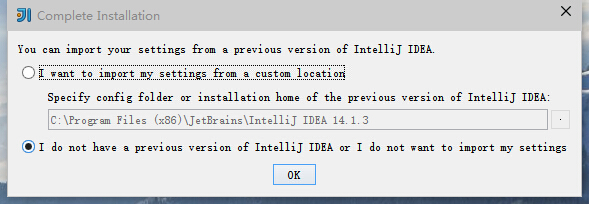
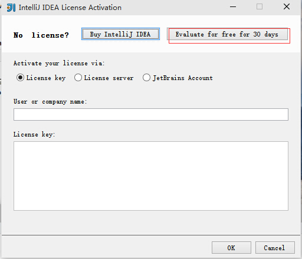
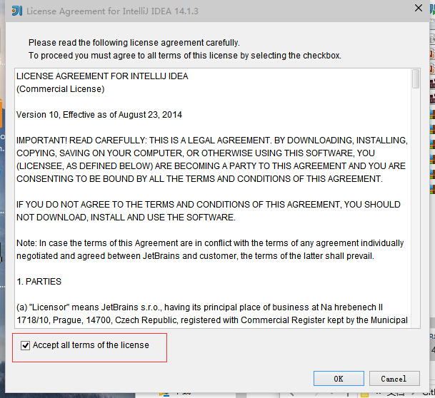
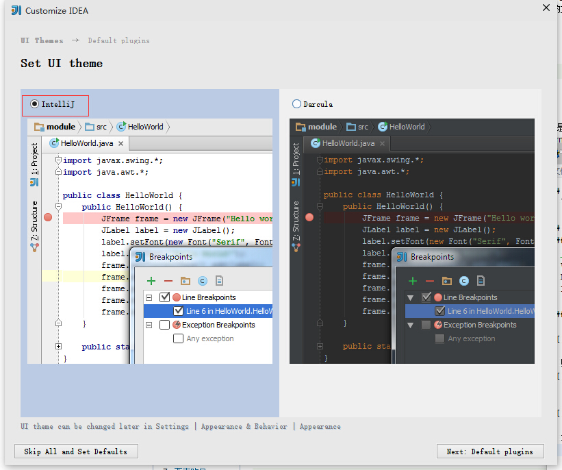
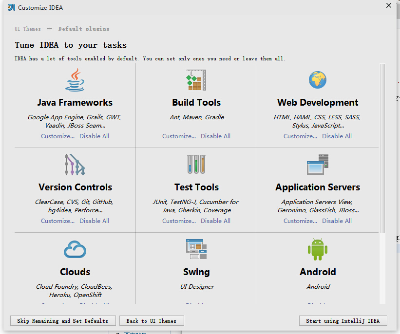
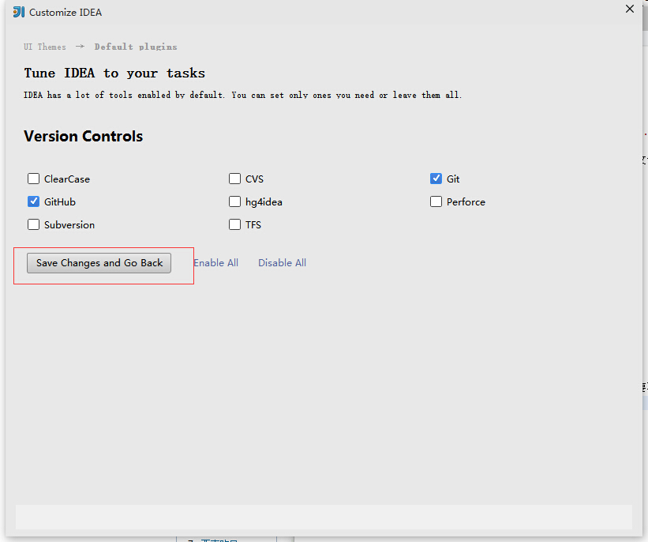
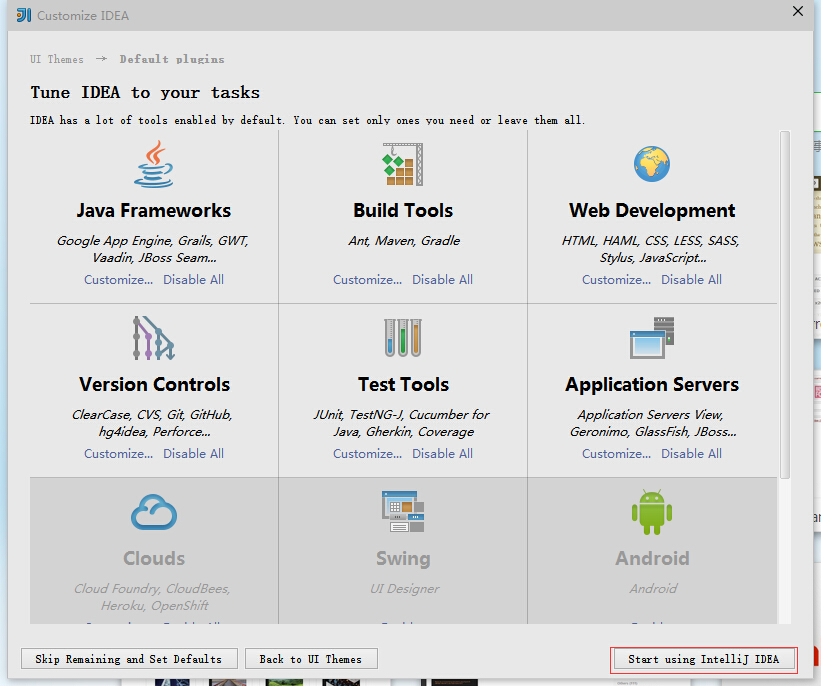
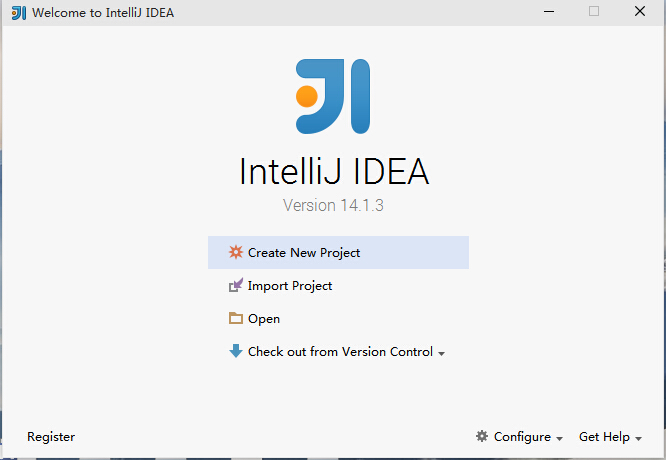

## 0.1 关于IntelliJ IDEA
- 商业版使用30天,本教程将基于实用30天的商业版本演示

## 0.2 安装
### 0.2.1 下载
- [https://www.jetbrains.com/idea/download/](https://www.jetbrains.com/idea/download/)选择自己需要的操作系统版本
- windows版本双击安装;
- Mac OS X版本双击dmg文件,将IntelliJ IDEA 拖入applications文件下;
- Linux:
  - `tar -zxvf ideaIU-14.1.3.tar.gz`;
  - `cd idea-IU-141.1010.3/bin`;
  - `./idea.sh`;
  - 若报`Startup Error: Unable to detect graphics environment `,执行`export DISPLAY=:0.0`;
### 0.2.2 初次启动
- 以前安装过选第一项,以前未安装选第二项;

- 购买过的请输入序列号,没有购买的可使用30天;

- 同意协议

- 选择界面风格,按个人喜好

- 定制系统插件,只安装自己开发必须的,加快开发工具启动速度;若后期需要再用可配置;

