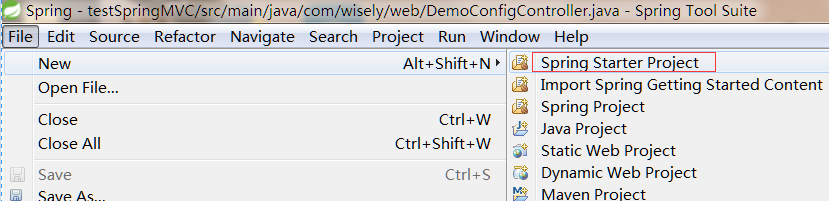
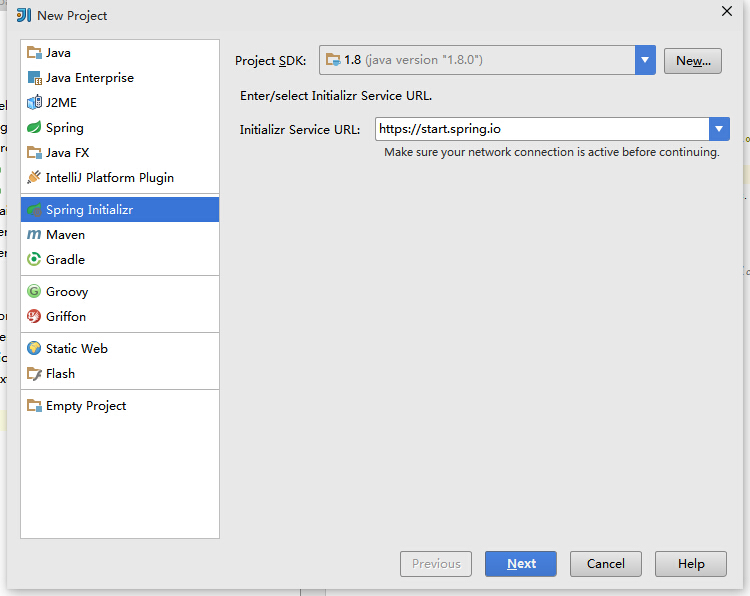
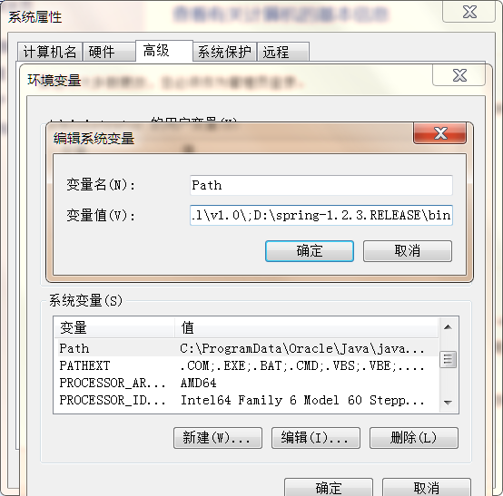
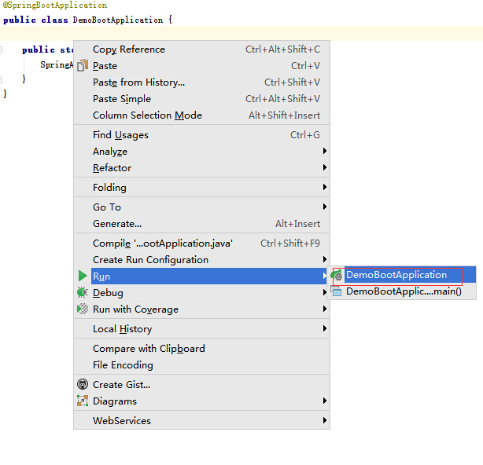
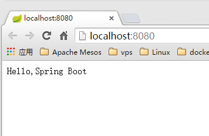

## 0.1 关于Spring Boot
- Spring Boot是一个基于`默认优于配置`理念的快速开发框架;
- Spring Boot几乎或者很少使用配置;
- 使用**@Conditional**实现了Spring Boot的自动配置功能;
- Spring Boot内嵌了servlet容器(tomcat或jetty),这意味着spring boot项目可独立运行而不需要额外的servlet容器;
- Spring Boot可以独立以jar包形式运行(`java -jar xx.jar`)
- Spring Boot给java语言带来了动态语言开发的飞一般开发速度;
- 本教程基于maven和IntelliJ IDEA演示;

## 0.2 搭建方式
### 0.2.1 利用在线模板构建
- 打开[http://start.spring.io/](http://start.spring.io/)
 - group:`com.wisely`
 - artifact:`demoboot`
 - name:`demoboot`
 - description:`Demo project for Spring Boot`
 - package name `com.wisely.demoboot`
 - type:`maven project`
 - packageing:`jar`
 - java version `1.7`
 - language `java`
 - Spring boot version `1.2.3`
- Generate Project
- 下载解压`demoboot.zip`


### 0.2.2 使用STS(Spring Tool Suite)


### 0.2.3 使用IntelliJ IDEA 14.1
步骤与使用在线模板一致


### 0.2.4 Spring Boot CLI
- 下载[Sping boot CLI](http://repo.spring.io/release/org/springframework/boot/spring-boot-cli/1.2.3.RELEASE/spring-boot-cli-1.2.3.RELEASE-bin.zip)
- 解压并将`bin`配置到环境变量的path中
  

- 初始化项目
  - 打开cmd输入

  ```shell
   spring init --dependencies=web,data-jpa my-project
  ```

### 0.2.5 手工构建
- 手工构建与上述情况其实是一样的;
- 只要maven的pom.xml里包含以下,我们的项目就成为了一个spring boot项目

```xml
<parent>
    <groupId>org.springframework.boot</groupId>
    <artifactId>spring-boot-starter-parent</artifactId>
    <version>1.2.3.RELEASE</version>
    <relativePath/> <!-- lookup parent from repository -->
</parent>

```
- 然后添加相应的`spring-boot-starter-*`到dependencies即可;
- 然后在相应的开发工具中导入maven项目;
- 目前推荐此方案构建，因为其他方案都涉及访问`http://start.spring.io`,这个网站国内经常访问不了;


### 0.2.6 开发工具推荐
- 在这里我们将使用一个新的开发工具叫**IntelliJ IDEA**;
- **IntelliJ IDEA**具有智能提示,不卡顿,功能全等诸多优点,是eclipse完全不能比拟的;
- 下载地址[https://www.jetbrains.com/idea/download/](https://www.jetbrains.com/idea/download/)
- 免费使用30天,因为在中国,你可以呵呵了

### 0.2.7 简单演示
- 在pom.xml里添加对web开发的支持,此处依赖不用加version,因为spring-boot-starter-parent已经对全局的常用jar包的版本做了定义
```xml
<dependency>
    <groupId>org.springframework.boot</groupId>
    <artifactId>spring-boot-starter-web</artifactId>
</dependency>
```

- 添加一个测试控制器

```java
package com.wisely.demoboot;

import org.springframework.boot.SpringApplication;
import org.springframework.boot.autoconfigure.SpringBootApplication;

@SpringBootApplication
public class DemoBootApplication {

    public static void main(String[] args) {
        SpringApplication.run(DemoBootApplication.class, args);
    }
}

```

- 运行
 - 在`DemoBootApplication`类上

 

 - 访问`http://localhost:8080`

  
