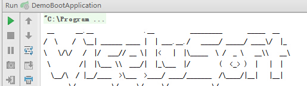

## 1.1 基本配置
- Spring Boot程序都有一个入口类,一般叫`*Application`,它是一个常规的java的main方法;
 - `*Application`应放在根包低下(如本例com.wisely.demoboot)
 - `*Application`会自动扫描同级或下级的包里需要自动配置的bean,实体等;

- Spring Boot的配置
 - 有一个全局配置配文件`application.properties`
 - Spring Boot倾向于使用java config;
 - 若必须使用xml配置,如遗留项目改造：使用一个注解有`@Configuration`的java类上使用`@ImportResource`

- 可执行jar包
 - spring boot的jar包含内嵌servlet容器,网页资源等,可独立运行;
 - 使用`spring-boot-maven-plugin`生成可执行jar包;

- `starter poms`
 - spring boot提供了多种自动配置的`starter poms`(加入对应的依赖可获得相应的自动配置)
 - 使用`starter poms`只需添加相应依赖到`pom.xml`文件,如上例添加的`spring-boot-starter-web`

 - 生产环境的监控与管理

 `spring-boot-starter-actuator:开启监控等支持`  
 `spring-boot-starter-remote-shell :允许远程`ssh`访问`  

 - servlet容器

 `spring-boot-starter-tomcat:内嵌tomcat容器`  
 `spring-boot-starter-jetty:内嵌jetty容器`  

 - 日志

 `spring-boot-starter-log4j:Log4j支持`  
 `spring-boot-starter-jetty:spring boot默认日志(Logback)`  

 - 模板引擎

 `spring-boot-starter-freemarker:freemarker模板引擎支持`  
 `spring-boot-starter-groovy-templates:groovy模板引擎支持`  
 `spring-boot-starter-thymeleaf:thymeleaf模板引擎支持,spring boot推荐`  
 `spring-boot-starter-velocity:velocity模板引擎支持`  
 `spring-boot-starter-mustache:mustache模板引擎支持`  

  - 数据访问

 `spring-boot-starter-data-jpa:jpa支持`  
 `spring-boot-starter-data-mongodb:mongodb支持`  
 `spring-boot-starter-jdbc:jdbc支持`  
 `spring-boot-starter-redis:redis支持`  

 - 更多的`starter`请参考《spring boot reference》文档

### 1.1.1 入口类`DemoBootApplication`

```java
package com.wisely.demoboot;

import org.springframework.boot.SpringApplication;
import org.springframework.boot.autoconfigure.SpringBootApplication;

@SpringBootApplication
public class DemoBootApplication {

    public static void main(String[] args) {
        SpringApplication.run(DemoBootApplication.class, args);
    }
}

```
### 1.1.2 核心配置`@SpringBootApplication`
- @SpringBootApplication源码

```java
@Target({ElementType.TYPE})
@Retention(RetentionPolicy.RUNTIME)
@Documented
@Inherited
@Configuration
@EnableAutoConfiguration
@ComponentScan
public @interface SpringBootApplication {
    Class<?>[] exclude() default {};
}
```
- 从源码看出@SpringBootApplication是一个组合了@Configuration,@EnableAutoConfiguration,@ComponentScan的元注解;
- @EnableAutoConfiguration
 - @EnableAutoConfiguration告诉spring boot根据classpath里的jar包自动猜测采用何种配置;
 - 我们在上例添加了`spring-boot-starter-web`,Spring boot会猜测我们开发的是web项目而做好相关的配置;
 - 如我们是一个jpa程序`@EnableAutoConfiguration`会自动配置扫描@Entity
- @ComponentScan
 - @ComponentScan无需指定扫描包,自动扫描`*Application`会自动扫描同级或下级的包里的bean;

### 1.1.3 关闭特定的自动配置
- 自动配置是非入侵式的,任何时候你都可以用自己的配置替代自动配置;

```java
@Configuration
//关闭数据源自动配置
@EnableAutoConfiguration(exclude={DataSourceAutoConfiguration.class})
public class MyConfiguration {
}
```

### 1.1.4 定制banner  
- spring boot图案定制  
1.spring boot默认启动会出现下图案  

```
  .   ____          _            __ _ _
 /\\ / ___'_ __ _ _(_)_ __  __ _ \ \ \ \
( ( )\___ | '_ | '_| | '_ \/ _` | \ \ \ \
 \\/  ___)| |_)| | | | | || (_| |  ) ) ) )
  '  |____| .__|_| |_|_| |_\__, | / / / /
 =========|_|==============|___/=/_/_/_/
 :: Spring Boot ::        (v1.2.3.RELEASE)
```

2.在classpath下新建banner.txt,我放置在src/main/resources/下  
3.打开网站http://patorjk.com/software/taag 输入你要用的字符(WiselySoft)  
4.复制到banner.txt  
5.效果  
 

- 关闭banner  
1.main里的内容修改为  
```java
SpringApplication app = new SpringApplication(DemoBootApplication.class, args);
app.setShowBanner(false);
app.run(args);
```
2.或使用fluent api修改为  
```java
 new SpringApplicationBuilder(DemoBootApplication.class)
                .showBanner(false)
                .run(args);
```