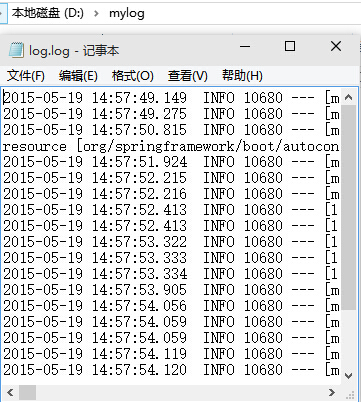
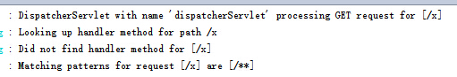

## 3.1 日志
- Spring boot内部使用Commons Logging作为日志实现

- 我们在开发中可使用`Java Util Logging, Log4J, Log4J2和 Logback`

- spring boot提供了日志相关的`Starter POMs`

- 默认情况下,spring boot默认使用logback作为日志实现

- 配置log文件(在application.properties内)

 ```java
logging.file=D:/mylog/log.log
 ```
- 日志级别(在application.properties内)

```java
logging.level.org.springframework.web: DEBUG
```

## 3.2 演示
- 配置日志文件位置
- 将org.springframework.web级别设置为DEBUG

### 3.2.1 添加配置

- application.properties  

```java
logging.file=D:/mylog/log.log
logging.level.org.springframework.web: DEBUG
```

### 3.2.2 测试

1.启动程序  

2.D盘截图  


3.使用错误路径访问程序测试日志级别(http://localhost:8080/x)
 - 在没有添加`logging.level.org.springframework.web: DEBUG`情况下控制台无任何反应
 - 添加后显示如下  
 
