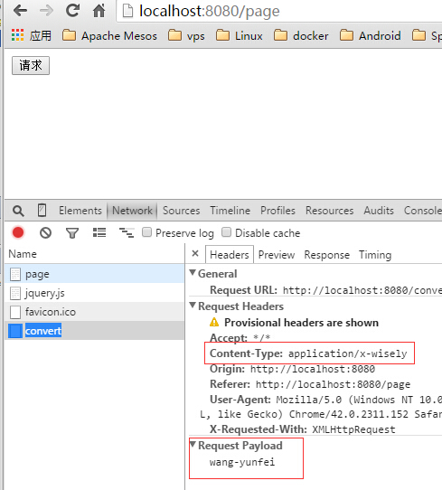
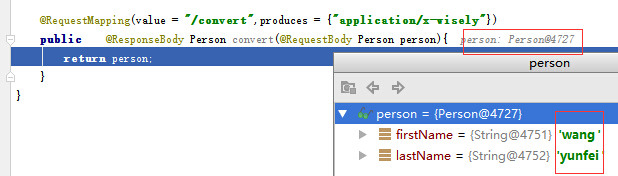
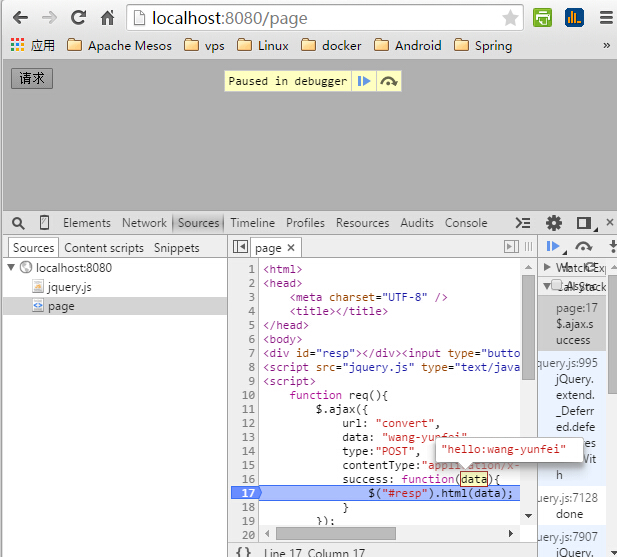
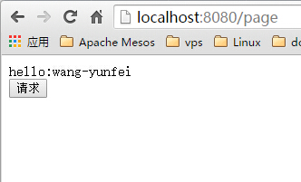
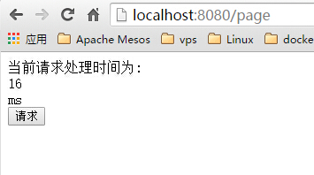
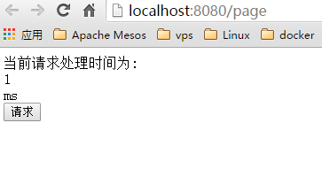

## 5.1 Spring Boot的MVC开发
### 5.1.1 Spring MVC的自动配置

- 支持发布静态资源和webjars
 - 在classpath下的`/static,/pulic,resources,/META-INF/resources`目录都可以直接访问(静态资源)
 - 添加静态资源目录通过继承`WebMvcConfigurerAdapter`重载`addResourceHandlers`方法
 - 采用webjar的jar包,目录中的`/webjars/**`会成为静态资源发布([关于webjar](http://www.webjars.org/),主要将js框架打到jar包里);
 - 如果我们要打成jar包的话,不要使用`src/main/webapp`,用jar打包方式会忽略此目录;


- 支持`HttpMessageConverters`,默认已注册json,xml等等的converter
 - Spring MVC通过`HttpMessageConverter`对http request和response进行转换;
 - 若classpath的包,将会自动支持转换request中的json,xml为对象,或转换对象为json,xml到response中;
 - 若需增加自定义的converter,自定义Converter需继承AbstractHttpMessageConverter
 - 在继承`WebMvcConfigurerAdapter`的配置类里重载`configureMessageConverters`方法


### 5.1.2 接管Spring MVC的自动配置
- 完全接管: 在一个注解有`@Configuration`的配置类上使用`@EnableWebMVC`注解;

- 部分接管: 如只是添加额外的拦截器,converter一类的
 - 让一个注解有`@Configuration`的配置类继承`WebMvcConfigurerAdapter`;
 - 添加`@Bean`来注册你的拦截器一类的配置;
 - 不需要使用@EnableWebMVC;

### 5.1.3 模板引擎支持
- Spring boot支持以下模板引擎
 - FreeMarker
 - Groovy
 - Thymeleaf(Spring Boot推荐)
 - Velocity
 - Mustache
 - 关于JSP：jsp在内嵌servlet容器有些问题(以jar形式运行),在spring boot里尽量避免使用jsp

- 页面默认位置:无论使用哪种模板引擎,模板页面默认放置在:`src/main/resources/templates`

### 5.1.4 定制内嵌servlet容器

- 通过`application.properties`
 - **《spring boot reference》Part X. Appendices** `server`打头的配置
 - 如:  
 ```java
 server.port=8080
 server.address= # bind to a specific NIC
 server.session-timeout= # session timeout in seconds
 ```
 - 功能实现请查看:`org.springframework.boot.autoconfigure.web.ServerProperties.java`
 
- 不针对特定的servlet容器:定义一个实现`EmbeddedServletContainerCustomizer`接口的bean

- 针对特定的servlet容器,定义`EmbeddedServletContainerFactory`的`@Bean`
 - tomcat: 返回`TomcatEmbeddedServletContainerFactory`的实例
 - jetty: 返回`JettyEmbeddedServletContainerFactory`的实例
 - undertow: 返回`UndertowEmbeddedServletContainerFactory`的实例

### 5.1.5 注册Servlet,Filter,Listener

- 注册Servlet:定义一个`ServletRegistrationBean`的`@Bean`;

- 注册Filter:定义一个`FilterRegistrationBean`的`@Bean`;

- 注册Listener:定义一个`ServletListenerRegistrationBean`的`@Bean`;

## 5.2 演示
- 5.2.1 自定义HttpMessageConverter
- 5.2.2 自定义interceptor拦截器
- 5.2.4 添加viewcontroller
- 5.2.4 演示不针对特定的servlet容器的定制
- 5.2.5 演示针对tomcat的容器定制
- 5.2.6 注册Servlet,Filter,Listener


### 5.2.1 自定义HttpMessageConverter
- 演示需页面,添加thymeleaf模板引擎支持
 - 去除`spring-boot-starter-web`依赖,因为`spring-boot-starter-thymeleaf`已包含
```xml
  <dependency>
        <groupId>org.springframework.boot</groupId>
        <artifactId>spring-boot-starter-thymeleaf</artifactId>
    </dependency>
```
- 在`resources`新建`static`目录放置静态文件,新建`templates`目录放置页面模板

- 自定义`HttpMessageConverter`-`WiselyMessageConverter`

```java
package com.wisely.demoboot.config;

import com.wisely.demoboot.domain.Person;
import org.springframework.http.HttpInputMessage;
import org.springframework.http.HttpOutputMessage;
import org.springframework.http.MediaType;
import org.springframework.http.converter.AbstractHttpMessageConverter;
import org.springframework.http.converter.HttpMessageNotReadableException;
import org.springframework.http.converter.HttpMessageNotWritableException;
import org.springframework.util.StreamUtils;

import java.io.IOException;
import java.nio.charset.Charset;

public class WiselyMessageConverter extends AbstractHttpMessageConverter<Person> {
    //自定义媒体类型
    public WiselyMessageConverter(){
        super(new MediaType("application", "x-wisely", Charset.forName("UTF-8")));
    }
    //从request里获得构造Person实例的数据
    @Override
    protected Person readInternal(Class<? extends Person> clazz,
     HttpInputMessage inputMessage) throws IOException, HttpMessageNotReadableException {
        String temp = StreamUtils.copyToString(inputMessage.getBody(), Charset.forName("UTF-8"));
        String[] tempArr = temp.split("-");
        return new Person(tempArr[0],tempArr[1]);
    }

    //只支持Person类
    @Override
    protected boolean supports(Class<?> clazz) {
        return Person.class.isAssignableFrom(clazz);
    }

    //将person实例转换成你想要的字符串格式
    @Override
    protected void writeInternal(Person person, HttpOutputMessage outputMessage) 
                                 throws IOException, HttpMessageNotWritableException {
        String out = "hello:" +person.getFirstName() + "-" + person.getLastName();
        outputMessage.getBody().write(out.getBytes());
    }


}

```

- 注册自定义的`WiselyMessageConverter`
 - 新建一个配置类专门覆盖配置mvc的配置

```java
 package com.wisely.demoboot.config;

import org.springframework.context.annotation.Configuration;
import org.springframework.http.converter.HttpMessageConverter;
import org.springframework.web.servlet.config.annotation.WebMvcConfigurerAdapter;

import java.util.List;

@Configuration
public class WiselyMvcConfig extends WebMvcConfigurerAdapter {
    @Override
    public void extendMessageConverters(List<HttpMessageConverter<?>> converters) {
        WiselyMessageConverter converter = new WiselyMessageConverter();
        converters.add(converter);
    }
}
 ```

- 演示控制器

```java
package com.wisely.demoboot;

import com.wisely.demoboot.domain.Person;
import org.springframework.stereotype.Controller;
import org.springframework.web.bind.annotation.RequestBody;
import org.springframework.web.bind.annotation.RequestMapping;
import org.springframework.web.bind.annotation.ResponseBody;
import org.springframework.web.bind.annotation.RestController;

import javax.validation.Valid;

@Controller
public class TestConverterController {
    @RequestMapping("/page")
    public String toPage(){
        return "testConverter";
    }

    @RequestMapping(value = "/convert",produces = {"application/x-wisely"})
    public    @ResponseBody Person convert(@RequestBody Person person){
        return person;
    }
}


```

- 演示页面
 - `src\main\resources\templates\testConverter.html`

```javascript
<html xmlns:th="http://www.thymeleaf.org">
<head>
    <meta charset="UTF-8" />
    <title></title>
</head>
<body>
<div id="resp"></div><input type="button" onclick="req();" value="请求"/>
<script src="jquery.js" type="text/javascript"></script>
<script>
    function req(){
        $.ajax({
            url: "convert",
            data: "wang-yunfei",
            type:"POST",
            contentType:"application/x-wisely",
            success: function(data){
                $("#resp").html(data);
            }
        });
    }

</script>
</body>
</html>
```

- 测试
 -   

 -   

 -   

 -   

### 5.2.2 注册自定义拦截器

- 自定义拦截器

```java
package com.wisely.demoboot.interceptors;

import javax.servlet.http.HttpServletRequest;
import javax.servlet.http.HttpServletResponse;

import org.springframework.web.servlet.ModelAndView;
import org.springframework.web.servlet.handler.HandlerInterceptorAdapter;
public class WiselyInteceptor extends HandlerInterceptorAdapter {
	@Override
	public boolean preHandle(HttpServletRequest request,
			HttpServletResponse response, Object handler) throws Exception {
		System.out.println("request processed");
		long startTime = System.currentTimeMillis();
		request.setAttribute("startTime", startTime);
		return true;
	}

	@Override
	public void postHandle(HttpServletRequest request,
			HttpServletResponse response, Object handler,
			ModelAndView modelAndView) throws Exception {
		System.out.println("response processed");
		long startTime = (Long) request.getAttribute("startTime");
		request.removeAttribute("startTime");
		long endTime = System.currentTimeMillis();
		request.setAttribute("handlingTime", endTime - startTime);
	}
}

```

- 注册此拦截器
 - 在`WiselyMvcConfig`重载`addInterceptors`方法

 ```java
 @Override
    public void addInterceptors(InterceptorRegistry registry) {
        registry.addInterceptor(new WiselyInteceptor());
    }
 ```

- 测试页面
 - 使用上面的`testConverter.html`
 - 添加
 ```
 当前请求处理时间为:<div th:text="${handlingTime}"></div>ms<br/>
 ```

- 测试




### 5.2.3 添加viewcontroller
- 注册快捷的viewcontroller是页面跳转映射的一种快捷方式,其中只包含简单的跳转没有业务处理逻辑

- 上例的控制器的`/page`跳转到`testConverter`页面,没有业务逻辑处理

- 注释到上例那段代码

```java
//    @RequestMapping("/page")
//    public String toPage(){
//        return "testConverter";
//    }
```

- 在`WiselyMvcConfig`中重载`addViewControllers`

```java
 @Override
    public void addViewControllers(ViewControllerRegistry registry) {
        registry.addViewController("/page").setViewName("testConverter");
    }
```

- 启动测试,访问http://localhost:8080/page
 - 依然正常访问  

 


### 5.2.4 演示不针对特定的servlet容器的定制

- 清空`application.properties`

- 定义`WiselyServletContainer`

```java
package com.wisely.demoboot.config;

import org.springframework.boot.context.embedded.ConfigurableEmbeddedServletContainer;
        import org.springframework.boot.context.embedded.EmbeddedServletContainerCustomizer;
        import org.springframework.stereotype.Component;

        import java.util.concurrent.TimeUnit;


@Component
public class WiselyServletContainer implements EmbeddedServletContainerCustomizer {
    @Override
    public void customize(ConfigurableEmbeddedServletContainer container) {
        container.setPort(9000);
    }
}

```

- 测试启动

```
 Tomcat started on port(s): 9000 (http)
```

### 5.2.5 演示针对tomcat的容器定制

- 注释上例的@Component(`//@Component`)

- 在`DemoBootApplication`中定义@Bean(只要在注解有@Configutation的类都可)

```java
   @Bean
    public EmbeddedServletContainerFactory wiselyTomcatContainer(){
        TomcatEmbeddedServletContainerFactory factory = new TomcatEmbeddedServletContainerFactory();
        factory.setPort(9999);
        return factory;
    }
```

- 测试启动

```
Tomcat started on port(s): 9999 (http)
```

### 5.2.6 注册Servlet,Filter,Listener

- 在任意注解有`@Configuration`的配置类中:


```java
   @Bean
    public ServletRegistrationBean servletRegistrationBean(){
        return new ServletRegistrationBean(new XxServlet(),"/xx/*");
    }
    @Bean
    public FilterRegistrationBean filterRegistrationBean(){
        FilterRegistrationBean registrationBean = new FilterRegistrationBean();
        registrationBean.setFilter( new YyFilter());
        registrationBean.setOrder(2);
        return registrationBean;
    }

    @Bean
    public ServletListenerRegistrationBean<ZzListener> zzListenerServletRegistrationBean(){
        return new ServletListenerRegistrationBean<ZzListener>(new ZzListener());
    }

```