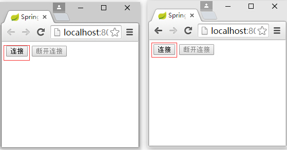
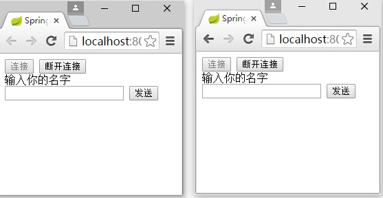
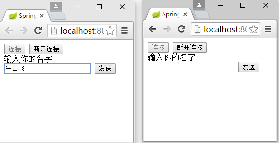
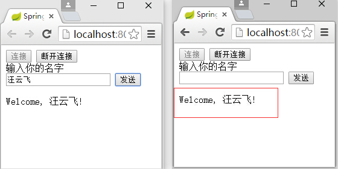
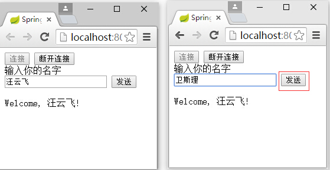
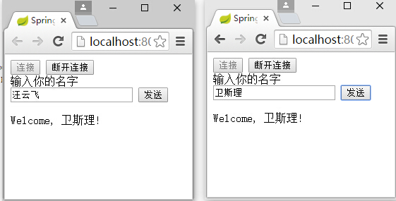
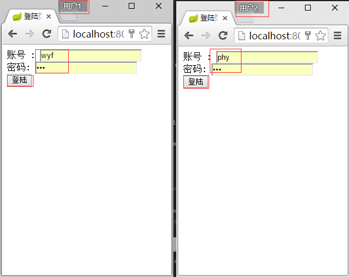
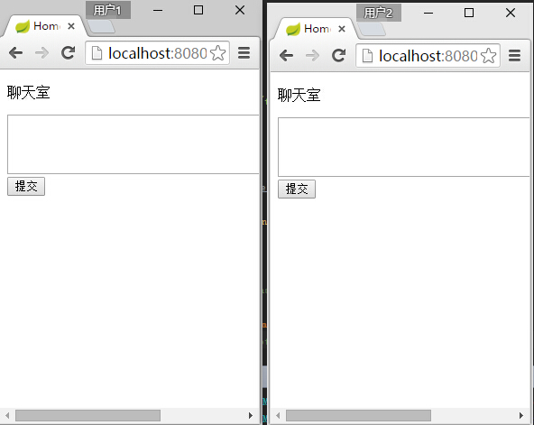
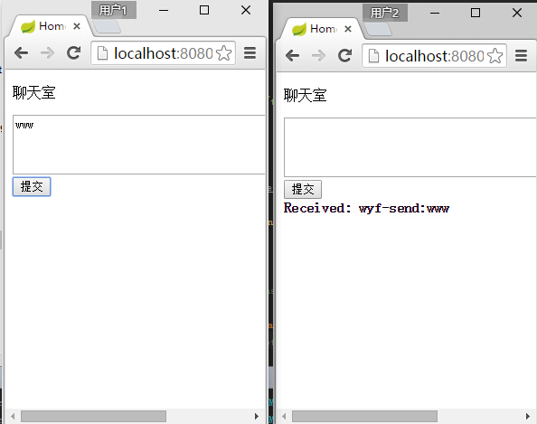
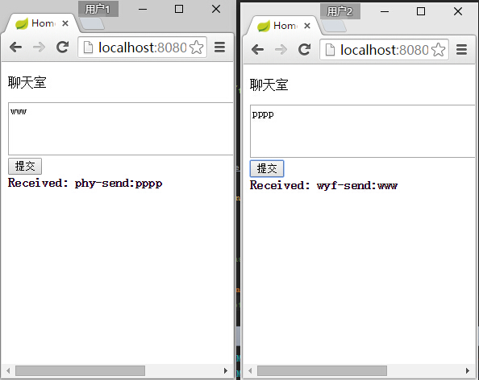

## 6.1 WebSocket
- `WebSocket`对服务器端和浏览器的双向通讯提供了支持;
- `WebSocket`一个基于TCP的轻量级协议;
- 可定义`WebSocket`子协议来传递数据
 - 本教程使用`STOMP`协议来演示

## 6.2 示例
### 6.2.1 websocket订阅广播式

- 此例基于[Using WebSocket to build an interactive web application](https://spring.io/guides/gs/messaging-stomp-websocket/)修改,修改了一些命名,更利于理解

- 添加spring boot开放websocket依赖

```xml
<dependency>
    <groupId>org.springframework.boot</groupId>
    <artifactId>spring-boot-starter-websocket</artifactId>
</dependency>
```

- 添加页面端的脚本支持
 - 下载`sockjs.min.js`到`static`文件夹
 - 下载`stomp.min.js`到`static`文件夹

- 发送信息类

```java
package com.wisely.demoboot.domain;

public class WiselyMessage {
    private String name;

    public String getName(){
        return name;
    }
}

```

- 返回信息类

```java
package com.wisely.demoboot.domain;

public class WiselyResponse {
    private String responseMessage;
    public WiselyResponse(String responseMessage){
        this.responseMessage = responseMessage;
    }
    public String getResponseMessage(){
        return responseMessage;
    }
}

```

- `websocket`配置文件

```java
package com.wisely.demoboot.config;

import org.springframework.context.annotation.Configuration;
import org.springframework.messaging.simp.config.MessageBrokerRegistry;
import org.springframework.web.socket.config.annotation.AbstractWebSocketMessageBrokerConfigurer;
import org.springframework.web.socket.config.annotation.EnableWebSocketMessageBroker;
import org.springframework.web.socket.config.annotation.StompEndpointRegistry;

/**
 * 配置开启对websocket和STOMP消息支持
 */
@Configuration
@EnableWebSocketMessageBroker //开启由消息拦截器支撑的websocket信息处理
public class WiselyWebSocketConfig extends AbstractWebSocketMessageBrokerConfigurer{

    @Override
    public void registerStompEndpoints(StompEndpointRegistry registry) {
        registry.addEndpoint("/endpoint").withSockJS(); //注册一个SockJS的endporint,因为页面使用的sockjs
    }


    @Override
    public void configureMessageBroker(MessageBrokerRegistry registry) {
        registry.enableSimpleBroker("/topic"); //开启一个内存消息拦截器
        registry.setApplicationDestinationPrefixes("/app");//页面发送信息的地址为/app/welcome
    }
}


```

- `websocket` 演示控制器

```java
package com.wisely.demoboot;

import com.wisely.demoboot.domain.WiselyMessage;
import com.wisely.demoboot.domain.WiselyResponse;
import org.springframework.messaging.handler.annotation.MessageMapping;
import org.springframework.messaging.handler.annotation.SendTo;
import org.springframework.stereotype.Controller;
//Spring支持将STOMP信息路由到@Controller
@Controller
public class WsController {
    @MessageMapping("/welcome") //前台发送STOMP信息到/hello被say方法处理,类似于@RequestMapping
    @SendTo("/topic/getResponse") //返回信息广播到所有订阅了/topic/getResponse的浏览器页面
    public WiselyResponse say(WiselyMessage message) throws Exception {
        Thread.sleep(3000); // 模仿做过一些业务处理
        return new WiselyResponse("Welcome, " + message.getName() + "!");
    }
}


```

- 添加演示页面`ws.html`

```javascript
<!DOCTYPE html>
<html xmlns:th="http://www.thymeleaf.org">
<head>
    <meta charset="UTF-8" />
    <title>Spring Boot+WebSocket示例</title>

</head>
<body onload="disconnect()">
<noscript><h2 style="color: #ff0000">貌似你的浏览器不支持websocket</h2></noscript>
<div>
    <div>
        <button id="connect" onclick="connect();">连接</button>
        <button id="disconnect" disabled="disabled" onclick="disconnect();">断开连接</button>
    </div>
    <div id="conversationDiv">
        <label>输入你的名字</label><input type="text" id="name" />
        <button id="sendName" onclick="sendName();">发送</button>
        <p id="response"></p>
    </div>
</div>
<script src="sockjs.min.js"></script>
<script src="stomp.min.js"></script>
<script src="jquery.js"></script>
<script type="text/javascript">
    var stompClient = null;

    function setConnected(connected) {
        document.getElementById('connect').disabled = connected;
        document.getElementById('disconnect').disabled = !connected;
        document.getElementById('conversationDiv').style.visibility = connected ? 'visible' : 'hidden';
        $('#response').html();
    }

    function connect() {
        var socket = new SockJS('/endpoint');
        stompClient = Stomp.over(socket);
        stompClient.connect({}, function(frame) {
            setConnected(true);
            console.log('Connected: ' + frame);
            //订阅/topic/getResponse
            stompClient.subscribe('/topic/getResponse', function(respnose){
                showResponse(JSON.parse(respnose.body).responseMessage);
            });
        });
    }

    function disconnect() {
        if (stompClient != null) {
            stompClient.disconnect();
        }
        setConnected(false);
        console.log("Disconnected");
    }

    function sendName() {
        var name = $('#name').val();
        //向控制器发送数据
        stompClient.send("/app/welcome", {}, JSON.stringify({ 'name': name }));
    }

    function showResponse(message) {
          var response = $("#response");
          response.html(message);
    }
</script>
</body>
</html>
```

- 注册该页面的viewController
 - 在`WiselyMvcConfig`的`addViewControllers`添加

 ```java
 registry.addViewController("/ws").setViewName("ws");
 ```

- 运行测试,访问http://localhost:8080/ws

 

 

 

 

 

 


### 6.2.2 websocket指定用户式

- 上例既不知道发送消息的人是谁,也不能将信息发送给指定用户

- 演示需添加需添加**Spring Security**支持

```xml
<dependency>
    <groupId>org.springframework.boot</groupId>
    <artifactId>spring-boot-starter-security</artifactId>
</dependency>
```
- **Spring Security**配置

```java
package com.wisely.demoboot.config;

import org.springframework.context.annotation.Configuration;
import org.springframework.security.config.annotation.authentication.builders.AuthenticationManagerBuilder;
import org.springframework.security.config.annotation.web.builders.HttpSecurity;
import org.springframework.security.config.annotation.web.builders.WebSecurity;
import org.springframework.security.config.annotation.web.configuration.WebSecurityConfigurerAdapter;
import org.springframework.security.config.annotation.web.servlet.configuration.EnableWebMvcSecurity;

@Configuration
@EnableWebMvcSecurity
public class WebSecurityConfig extends WebSecurityConfigurerAdapter{
    @Override
    protected void configure(HttpSecurity http) throws Exception {
        http
                .authorizeRequests()
                .antMatchers("/","/login").permitAll()//根路径和/login路径不拦截
                .anyRequest().authenticated()
                .and()
                .formLogin()
                .loginPage("/login") //登陆页面
                .defaultSuccessUrl("/chat") //登陆成功转向该页面
                .permitAll()
                .and()
                .logout()
                .permitAll();
    }

    //在内存中注册两个用户
    @Override
    protected void configure(AuthenticationManagerBuilder auth) throws Exception {
        auth
                .inMemoryAuthentication()
                .withUser("wyf").password("wyf").roles("USER")
                .and()
                .withUser("phy").password("phy").roles("USER");
    }
    //忽略静态资源的拦截
    @Override
    public void configure(WebSecurity web) throws Exception {
        web.ignoring().antMatchers("/resources/static/**");
    }

}

```

- 在`WiselyMvcConfig`的`addViewControllers`添加本例所需的映射

```java
registry.addViewController("/login").setViewName("login");
registry.addViewController("/chat").setViewName("chat");
```

- 演示控制器`WsController`添加

```java
  //消息发送模板
    @Autowired
    private  SimpMessagingTemplate  messagingTemplate;
     @MessageMapping("/chat")
    public void handleChat(Principal principal, String msg) {
        //从principal取出消息发送用户
        if(principal.getName().equals("phy")){
            //向指定用户wyf发送消息
            messagingTemplate.convertAndSendToUser("wyf", "/queue/notifications", 														principal.getName()+"-send:"+msg);
        }
        else{
            //向指定用户phy发送消息
            messagingTemplate.convertAndSendToUser("phy", "/queue/notifications",                                    						principal.getName()+"-send:"+msg);
        }
```

- 登陆页面

```javascript
<!DOCTYPE html>
<html xmlns="http://www.w3.org/1999/xhtml" xmlns:th="http://www.thymeleaf.org"
      xmlns:sec="http://www.thymeleaf.org/thymeleaf-extras-springsecurity3">
<meta charset="UTF-8" />
<head>
    <title>登陆页面</title>
</head>
<body>
<div th:if="${param.error}">
    无效的账号和密码
</div>
<div th:if="${param.logout}">
    你已注销
</div>
<form th:action="@{/login}" method="post">
    <div><label> 账号 : <input type="text" name="username"/> </label></div>
    <div><label> 密码: <input type="password" name="password"/> </label></div>
    <div><input type="submit" value="登陆"/></div>
</form>
</body>
</html>
```

- 演示页面

```javascript
<!DOCTYPE html>

<html xmlns:th="http://www.thymeleaf.org">
<meta charset="UTF-8" />
<head>
    <title>Home</title>
    <script src="sockjs.min.js"></script>
    <script src="stomp.min.js"></script>
    <script src="jquery.js"></script>
</head>
<body>
<p>
    聊天室
</p>

<form id="wiselyForm">
    <textarea rows="4" cols="60" name="text"></textarea>
    <input type="submit"/>
</form>

<script th:inline="javascript">
    $('#wiselyForm').submit(function(e){
        e.preventDefault();
        var text = $('#wiselyForm').find('textarea[name="text"]').val();
        sendSpittle(text);
    });

    var sock = new SockJS("/endpointChat");
    var stomp = Stomp.over(sock);
    stomp.connect('guest', 'guest', function(frame) {
        stomp.subscribe("/user/queue/notifications", handleNotification);
    });


    function handleNotification(message) {
        $('#output').append("<b>Received: " + message.body + "</b><br/>")
    }

    function sendSpittle(text) {
        stomp.send("/app/chat", {}, text);
    }
    $('#stop').click(function() {sock.close()});
</script>

<div id="output"></div>
</body>
</html>
```

- 运行演示

- chrome浏览器启动2个用户,这样每个chrome页面都可以有独立的session(在设置里添加用户)




