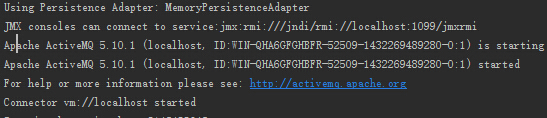
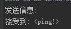

## 7.1 异步消息
- 请求者不是将信息直接发给被请求者,请求者无需等待被请求者的响应;

- Spring支持JMS(Java Message Service)和AMQP(Advanced Message Queuing Protocol)

- 消息发送支持点对点(point-to-point)和订阅发布式(publish-suscribe)

- 在实际项目中信息发送者和接受者应该分开的,下面示例为了简单都写在一个程序里了

## 7.2 演示
- 7.2.1 JMS
- 7.2.2 AMQP

### 7.2.1 JMS
- 使用程序内置的ActiveMQ server



- 使用`JmsTemplate`发送消息

- 使用`@JmsListener`接受消息

- 新建空的spring boot项目

- 新增jms及activemq的依赖

```xml
<dependency>
    <groupId>org.springframework</groupId>
    <artifactId>spring-jms</artifactId>
</dependency>
<dependency>
    <groupId>org.apache.activemq</groupId>
    <artifactId>activemq-broker</artifactId>
</dependency>
```

- 编写接受消息方法

```java
package demo;

import org.springframework.beans.factory.annotation.Autowired;
import org.springframework.context.ConfigurableApplicationContext;
import org.springframework.jms.annotation.JmsListener;
import org.springframework.stereotype.Component;


@Component
public class Receiver {


    //从目的地mailbox-destination监听接受消息
    @JmsListener(destination = "mailbox-destination")
    public void receiveMessage(String message){
        System.out.println("接受到: <" + message + ">");
    }
}

```

- 在入口类中发送信息

```java
package demo;

import org.springframework.boot.SpringApplication;
import org.springframework.boot.autoconfigure.SpringBootApplication;
import org.springframework.context.ConfigurableApplicationContext;
import org.springframework.context.annotation.Bean;
import org.springframework.jms.config.JmsListenerContainerFactory;
import org.springframework.jms.config.SimpleJmsListenerContainerFactory;
import org.springframework.jms.core.JmsTemplate;
import org.springframework.jms.core.MessageCreator;

import javax.jms.ConnectionFactory;
import javax.jms.JMSException;
import javax.jms.Message;
import javax.jms.Session;

@SpringBootApplication
public class JmsApplication {


    public static void main(String[] args) {
        // 启动程序
        ConfigurableApplicationContext context =
                             SpringApplication.run(JmsApplication.class, args);
        // 发送消息
        MessageCreator messageCreator = new MessageCreator() {
            @Override
            public Message createMessage(Session session) throws JMSException {
                return session.createTextMessage("ping!");
            }
        };
        JmsTemplate jmsTemplate = context.getBean(JmsTemplate.class);
        System.out.println("发送信息:");
        //发送消息的目的地是mailbox-destination
        jmsTemplate.send("mailbox-destination", messageCreator);
    }
}

```

- 运行测试



### 7.2.2 AMQP
- 因为rabbitmq是使用erlang语言开放,先安装[erlang](http://www.erlang.org/download.html)

- 下载安装[rabbitmq](https://www.rabbitmq.com/download.html)

- 启动rabbitmq

- spring boot为我们的自动配置
  - 默认rabbit server的host为`localhost`
  - 默认端口号为`5672`
  - 实际情况请查看`spring boot reference`以`spring.rabbitmq`打头的配置
  - 自动配置了`RabbitTemplate`的bean
  - 自动配置了`ConnectionFactory`的bean
  - 无需添加`@EnableRabbit`
  - 上面JMS的例子也是一样的

- 新建spring boot(选中IO中的AMQP)

- 新建`Receiver`

```java
package com.wisely.amqp;

import org.springframework.amqp.rabbit.annotation.RabbitListener;
import org.springframework.stereotype.Component;

@Component
public class Receiver {
    //监听队列wisely-queue
    @RabbitListener(queues = "wisely-queue")
    public void receiveMessage(String message) {
        System.out.println("Received <" + message + ">");
    }

}
```

- 在入口类中发送信息

```java
package com.wisely.amqp;

import org.springframework.amqp.core.Queue;
import org.springframework.amqp.rabbit.core.RabbitTemplate;
import org.springframework.boot.SpringApplication;
import org.springframework.boot.autoconfigure.SpringBootApplication;
import org.springframework.context.ConfigurableApplicationContext;
import org.springframework.context.annotation.Bean;

@SpringBootApplication
public class AmqpApplication {

    public static void main(String[] args) {
        ConfigurableApplicationContext context = SpringApplication.run(AmqpApplication.class, args);
        RabbitTemplate rabbitTemplate = context.getBean(RabbitTemplate.class);
        System.out.println("开始发送消息");
        //向队列wisely-queue发送消息
        rabbitTemplate.convertAndSend("wisely-queue", "来自RabbitMQ的问候");
    }

    //声明一个队列wisely-queue
    @Bean
    public Queue wiselyQueue(){
        return new Queue("wisely-queue");
    }


}

```

- 运行结果


