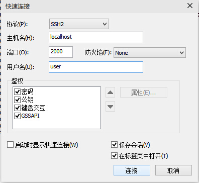
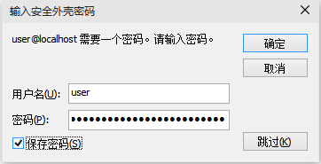
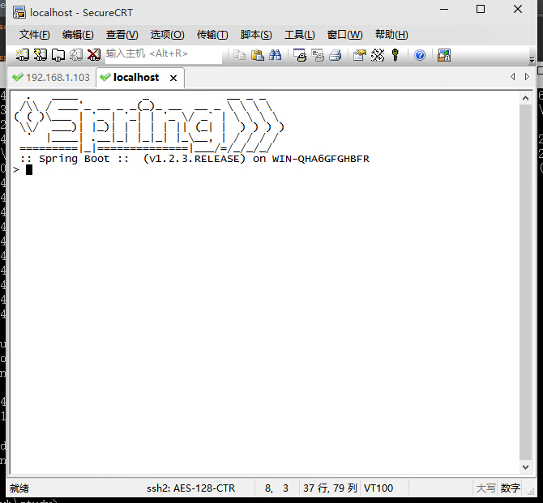
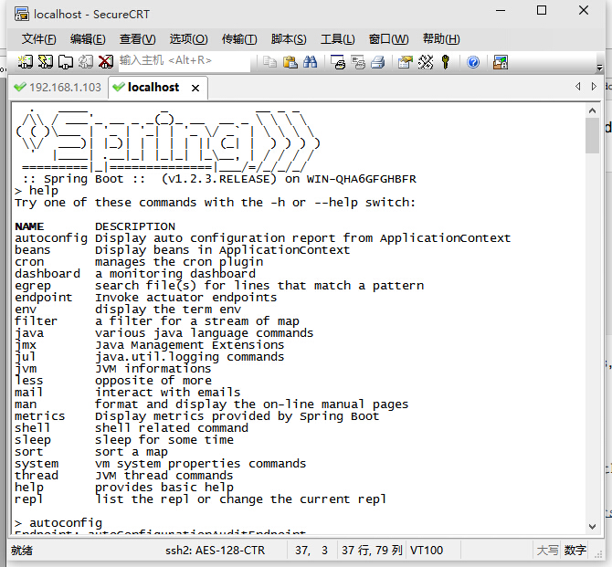

## 16.1 项目监控

- 使用spring boot actuator实现项目监控;

- 可以通过http,JMX或者ssh,telnet监控;

- 审计(auditing),健康(health)和指标(metrics)信息;

## 16.2 演示

### 16.2.1 web节点
- 添加actuator依赖
```xml
<dependency>
    <groupId>org.springframework.boot</groupId>
    <artifactId>spring-boot-starter-actuator</artifactId>
</dependency>
```
- 自动配置信息:http://localhost:8080/autoconfig
- beans:http://localhost:8080/beans
- 配置信息:http://localhost:8080/configprops
- dump:http://localhost:8080/dump
- 环境变量:http://localhost:8080/env
- 健康情况:http://localhost:8080/health
- 应用信息:http://localhost:8080/info
- 指标:http://localhost:8080/metrics
- 映射:http://localhost:8080/mappings
- 关闭程序:http://localhost:8080/shutdown(默认关闭)
- trace:http://localhost:8080/trace

### 16.2.1 ssh
- 添加remote shell依赖
```xml
<dependency>
    <groupId>org.springframework.boot</groupId>
    <artifactId>spring-boot-starter-actuator</artifactId>
</dependency>
```
- 登陆
- 密码在程序启动时候会自动分配

```java
Using default password for shell access: 023f3ff0-c7a3-4dce-abbe-d6fdcc518d9a
```

-使用任意的ssh客户端,putty或secureCRT等,本例使用的是secureCRT





