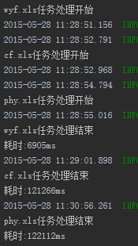
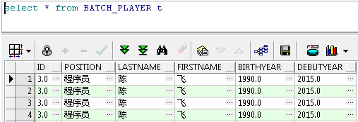
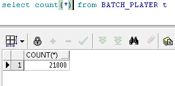

## 18.2

- `application.properties`
```java
spring.datasource.driverClassName=oracle.jdbc.OracleDriver
spring.datasource.url=jdbc\:oracle\:thin\:@192.168.1.103\:1521\:xe
spring.datasource.username=wyf
spring.datasource.password=wyf
spring.datasource.continueOnError=true
spring.batch.job.enabled=false
```

- 测试数据库:oracle
```sql
create table BATCH_PLAYER
(
  id        VARCHAR2(20),
  position   VARCHAR2(20),
  lastname  VARCHAR2(20),
  firstname VARCHAR2(20),
  birthyear VARCHAR2(20),
  debutyear VARCHAR2(20)
)
```

- 测试excel
 - [wyf.xls](resources/wyf.xls) 1000条数据
 - [phy.xls](resources/phy.xls) 10000条数据
 - [cf.xls](resources/cf.xls)   10000条数据

- `ExcelBatchConfig`

```java
package com.wisely.batchxls;

import org.springframework.batch.core.Job;
import org.springframework.batch.core.Step;
import org.springframework.batch.core.configuration.annotation.EnableBatchProcessing;
import org.springframework.batch.core.configuration.annotation.JobBuilderFactory;
import org.springframework.batch.core.configuration.annotation.StepBuilderFactory;
import org.springframework.batch.core.configuration.annotation.StepScope;
import org.springframework.batch.core.launch.support.RunIdIncrementer;
import org.springframework.batch.core.launch.support.SimpleJobLauncher;
import org.springframework.batch.core.repository.JobRepository;
import org.springframework.batch.core.repository.support.JobRepositoryFactoryBean;
import org.springframework.batch.item.ItemProcessor;
import org.springframework.batch.item.ItemReader;
import org.springframework.batch.item.ItemWriter;
import org.springframework.batch.item.database.BeanPropertyItemSqlParameterSourceProvider;
import org.springframework.batch.item.database.JdbcBatchItemWriter;
import org.springframework.batch.item.excel.RowMapper;
import org.springframework.batch.item.excel.mapping.BeanWrapperRowMapper;
import org.springframework.batch.item.excel.poi.PoiItemReader;
import org.springframework.beans.factory.annotation.Value;
import org.springframework.context.annotation.Bean;
import org.springframework.context.annotation.Configuration;
import org.springframework.core.io.ClassPathResource;
import org.springframework.transaction.PlatformTransactionManager;

import javax.sql.DataSource;

/**
 * Created by wisely on 2015/5/27.
 */
@Configuration
@EnableBatchProcessing
public class ExcelBatchConfig {

    @Bean
    @StepScope
    public PoiItemReader reader(@Value("#{jobParameters['input.file.name']}") String pathToFile){
        PoiItemReader reader = new PoiItemReader();
        reader.setLinesToSkip(1);
        reader.setResource(new ClassPathResource(pathToFile));
        reader.setRowMapper(rowMapper());
        return reader;
    }


    @Bean
    public RowMapper rowMapper(){
        BeanWrapperRowMapper rowMapper = new BeanWrapperRowMapper();
        rowMapper.setTargetType(Player.class);
        return rowMapper;
    }

    @Bean
    public ItemProcessor<Player, Player> processor() {
        return new PlayerItemProcessor();
    }

    @Bean
    @StepScope
    public ItemWriter<Player> writer(DataSource dataSource,
                                     @Value("#{jobParameters['sql']}") String sql) {
        JdbcBatchItemWriter<Player> writer = new JdbcBatchItemWriter<Player>();
        writer.setItemSqlParameterSourceProvider(new BeanPropertyItemSqlParameterSourceProvider<Player>());
        writer.setSql(sql);
        writer.setDataSource(dataSource);
        return writer;
    }

    @Bean
    public JobRepository jobRepository(DataSource dataSource,
                                       PlatformTransactionManager transactionManager) throws Exception {
        JobRepositoryFactoryBean jobRepositoryFactoryBean = new JobRepositoryFactoryBean();
        jobRepositoryFactoryBean.setDataSource(dataSource);
        jobRepositoryFactoryBean.setTransactionManager(transactionManager);
        jobRepositoryFactoryBean.setDatabaseType("oracle");
        return jobRepositoryFactoryBean.getObject();
    }

    @Bean
    public SimpleJobLauncher jobLauncher(DataSource dataSource,
                                         PlatformTransactionManager transactionManager) throws Exception{
        SimpleJobLauncher jobLauncher = new SimpleJobLauncher();
        jobLauncher.setJobRepository(jobRepository(dataSource,transactionManager));
        return jobLauncher;
    }

    @Bean
    public Job importUserJob(JobBuilderFactory jobs, Step s1) {
        return jobs.get("importUserJob")
                .incrementer(new RunIdIncrementer())
                .flow(s1)
                .end()
                .listener(new WiselyJobListener())
                .build();
    }

    @Bean
    public Step step1(StepBuilderFactory stepBuilderFactory, ItemReader<Player> reader,
                      ItemWriter<Player> writer, ItemProcessor<Player, Player> processor) {
        return stepBuilderFactory.get("step1")
                .<Player, Player> chunk(10)
                .reader(reader)
                .processor(processor)
                .writer(writer)
                .build();
    }

}

```

- `Player`

```java
package com.wisely.batchxls;

public class Player {

    private String id;
    private String position;
    private String lastName;
    private String firstName;
    private String birthYear;
    private String debutYear;

    public String getId() {
        return id;
    }

    public void setId(String id) {
        this.id = id;
    }

    public String getPosition() {
        return position;
    }

    public void setPosition(String position) {
        this.position = position;
    }

    public String getLastName() {
        return lastName;
    }

    public void setLastName(String lastName) {
        this.lastName = lastName;
    }

    public String getFirstName() {
        return firstName;
    }

    public void setFirstName(String firstName) {
        this.firstName = firstName;
    }

    public String getBirthYear() {
        return birthYear;
    }

    public void setBirthYear(String birthYear) {
        this.birthYear = birthYear;
    }

    public String getDebutYear() {
        return debutYear;
    }

    public void setDebutYear(String debutYear) {
        this.debutYear = debutYear;
    }


}

```

- `PlayerItemProcessor`

```java
package com.wisely.batchxls;

import org.springframework.batch.item.ItemProcessor;


public class PlayerItemProcessor implements ItemProcessor<Player, Player> {

    @Override
    public Player process(Player item) throws Exception {
       if(item.getLastName().equals("汪")){
            item.setLastName("wang");
       }
        return item;
    }
}

```

- `WiselyJobListener`

```java
package com.wisely.batchxls;

import org.springframework.batch.core.JobExecution;
import org.springframework.batch.core.JobExecutionListener;
import org.springframework.batch.item.ExecutionContext;


public class WiselyJobListener implements JobExecutionListener{
    long startTime;
    long endTime;
    @Override
    public void beforeJob(JobExecution jobExecution) {
        String fileName = jobExecution.getJobParameters().getString("input.file.name");
        startTime = System.currentTimeMillis();
        System.out.println(fileName + "任务处理开始");
    }

    @Override
    public void afterJob(JobExecution jobExecution) {
        endTime = System.currentTimeMillis();
        String fileName = jobExecution.getJobParameters().getString("input.file.name");
        System.out.println(fileName+"任务处理结束");
        System.out.println("耗时:" + (endTime - startTime) + "ms");
    }
}


```

- `DemoController`

```java
package com.wisely.batchxls;

import org.springframework.batch.core.Job;
import org.springframework.batch.core.JobParameters;
import org.springframework.batch.core.JobParametersBuilder;
import org.springframework.batch.core.launch.JobLauncher;
import org.springframework.batch.item.excel.poi.PoiItemReader;
import org.springframework.beans.factory.annotation.Autowired;
import org.springframework.stereotype.Controller;
import org.springframework.web.bind.annotation.RequestMapping;
import org.springframework.web.bind.annotation.RequestParam;
import org.springframework.web.bind.annotation.ResponseBody;

/**
 * Created by wisely on 2015/5/27.
 */
@Controller
public class DemoController {
    @Autowired
    JobLauncher jobLauncher;

    @Autowired
    Job importUserJob;
    public JobParameters   jobParameters;
    @RequestMapping("/read")
    @ResponseBody
    public String export(@RequestParam String xls) throws Exception{
        String path = xls+".xls";
        String sql = "insert into batch_player " +
                "(id,position,firstname, lastname,birthyear,debutyear) " +
                "values(:id,:position,:firstName, :lastName,:birthYear,:debutYear)";

        jobParameters = new JobParametersBuilder().addLong("time", System.currentTimeMillis()).addString("input.file.name", path).addString("sql",sql).toJobParameters();
        jobLauncher.run(importUserJob,jobParameters);
        return "ok";
    }

}


```

- 测试运行
 - 浏览器发起多个处理任务
 ```
 http://localhost:8080/read?xls=wyf 处理wyf.xls
 http://localhost:8080/read?xls=phy 处理phy.xls
 http://localhost:8080/read?xls=cf  处理cf.xls
 ```
 - 输出结果
   
   
   
   