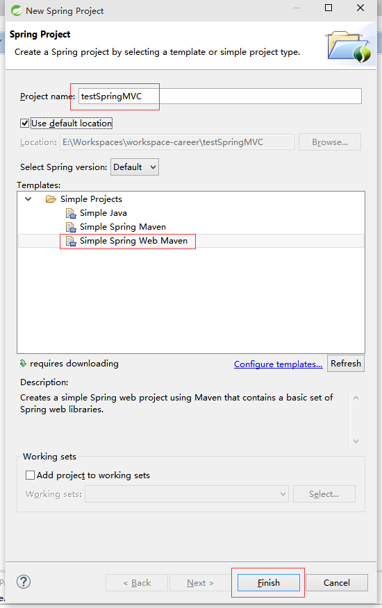
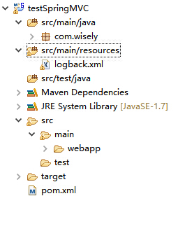
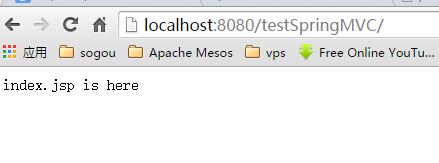

## 1.1 简单示例
- 通篇使用java config
- **@Controller**声明bean是一个控制器
- **@RequestMapping**访问路径和方法之间的映射

## 1.2 演示
### 1.2.1 新建maven web项目
- 新建项目



### 1.2.2 添加spring mvc依赖到maven
将`pom.xml`修改如下
```
<project xmlns="http://maven.apache.org/POM/4.0.0" xmlns:xsi="http://www.w3.org/2001/XMLSchema-instance"
	xsi:schemaLocation="http://maven.apache.org/POM/4.0.0 http://maven.apache.org/xsd/maven-4.0.0.xsd">
	<modelVersion>4.0.0</modelVersion>
	<artifactId>testSpringMVC</artifactId>
	<version>0.0.1-SNAPSHOT</version>
	<packaging>war</packaging>
	<properties>
		<!-- Generic properties -->
		<java.version>1.7</java.version>
		<project.build.sourceEncoding>UTF-8</project.build.sourceEncoding>
		<project.reporting.outputEncoding>UTF-8</project.reporting.outputEncoding>
		<!-- Web -->
		<jsp.version>2.2</jsp.version>
		<jstl.version>1.2</jstl.version>
		<servlet.version>2.5</servlet.version>
		<!-- Spring -->
		<spring-framework.version>4.1.5.RELEASE</spring-framework.version>
		<!-- Logging -->
		<logback.version>1.0.13</logback.version>
		<slf4j.version>1.7.5</slf4j.version>
	</properties>

	<dependencies>
		<dependency>
			<groupId>javax</groupId>
			<artifactId>javaee-web-api</artifactId>
			<version>7.0</version>
			<scope>provided</scope>
		</dependency>

		<!-- Spring MVC -->
		<dependency>
			<groupId>org.springframework</groupId>
			<artifactId>spring-webmvc</artifactId>
			<version>${spring-framework.version}</version>
		</dependency>

		<!-- Other Web dependencies -->
		<dependency>
			<groupId>javax.servlet</groupId>
			<artifactId>jstl</artifactId>
			<version>${jstl.version}</version>
		</dependency>
		<dependency>
			<groupId>javax.servlet</groupId>
			<artifactId>servlet-api</artifactId>
			<version>${servlet.version}</version>
			<scope>provided</scope>
		</dependency>
		<dependency>
			<groupId>javax.servlet.jsp</groupId>
			<artifactId>jsp-api</artifactId>
			<version>${jsp.version}</version>
			<scope>provided</scope>
		</dependency>

		<!-- Spring and Transactions -->
		<dependency>
			<groupId>org.springframework</groupId>
			<artifactId>spring-tx</artifactId>
			<version>${spring-framework.version}</version>
		</dependency>

		<!-- Logging with SLF4J & LogBack -->
		<dependency>
			<groupId>org.slf4j</groupId>
			<artifactId>slf4j-api</artifactId>
			<version>${slf4j.version}</version>
		</dependency>
		<dependency>
			<groupId>log4j</groupId>
			<artifactId>log4j</artifactId>
			<version>1.2.16</version>
		</dependency>
		<dependency>
			<groupId>org.slf4j</groupId>
			<artifactId>jcl-over-slf4j</artifactId>
			<version>${slf4j.version}</version>
		</dependency>
		<dependency>
			<groupId>ch.qos.logback</groupId>
			<artifactId>logback-classic</artifactId>
			<version>${logback.version}</version>
		</dependency>
		<dependency>
			<groupId>ch.qos.logback</groupId>
			<artifactId>logback-core</artifactId>
			<version>${logback.version}</version>
		</dependency>
		<dependency>
			<groupId>ch.qos.logback</groupId>
			<artifactId>logback-access</artifactId>
			<version>${logback.version}</version>
		</dependency>

	</dependencies>


	<groupId>com.wisely</groupId>
	<build>
		<plugins>
			<plugin>
				<groupId>org.apache.maven.plugins</groupId>
				<artifactId>maven-compiler-plugin</artifactId>
				<version>2.3.2</version>
				<configuration>
					<source>${java.version}</source>
					<target>${java.version}</target>
				</configuration>
			</plugin>
		</plugins>
	</build>
</project>


```
### 1.2.3 构建目录

- 删除`src/main/webapp/WEB-INF/web.xml`;
- 删除`src/main/resources`下的除`logback.xml`;
- 在`logback.xml`添加`<logger name="org.springframework.web" level="DEBUG"/>`,观察请求错误(4xx错误);
- 在`src/main/java`新建package`com.wisely`;
- 目录结构如图


### 1.2.4 基于java config的spring mvc的配置

本例基于java config,包括不使用web.xml

- Spring MVC的配置

```
package com.wisely;

import org.springframework.context.annotation.Bean;
import org.springframework.context.annotation.ComponentScan;
import org.springframework.context.annotation.Configuration;
import org.springframework.web.servlet.config.annotation.EnableWebMvc;
import org.springframework.web.servlet.config.annotation.WebMvcConfigurerAdapter;
import org.springframework.web.servlet.view.JstlView;
import org.springframework.web.servlet.view.UrlBasedViewResolver;

@Configuration
@ComponentScan("com.wisely")
@EnableWebMvc
public class DemoMVCConfig extends WebMvcConfigurerAdapter {

    //名称与实际的页面的映射
    // return "index" ; 实际返回的页面是/WEB-INF/views/index.jsp
	@Bean
	public UrlBasedViewResolver viewResolver(){
		UrlBasedViewResolver resolver = new UrlBasedViewResolver();
          resolver.setPrefix("/WEB-INF/views/");
        resolver.setSuffix(".jsp");
        resolver.setViewClass(JstlView.class);
        return resolver;
	}
}

```
- WebInitializer(相当于web.xml)

```
package com.wisely;

import javax.servlet.ServletContext;
import javax.servlet.ServletException;
import javax.servlet.ServletRegistration.Dynamic;
import javax.servlet.jsp.jstl.core.Config;

import org.springframework.web.WebApplicationInitializer;
import org.springframework.web.context.support.AnnotationConfigWebApplicationContext;
import org.springframework.web.servlet.DispatcherServlet;

public class WebInitializer implements WebApplicationInitializer {

	@Override
	public void onStartup(ServletContext servletContext)
			throws ServletException {
		    AnnotationConfigWebApplicationContext ctx = new AnnotationConfigWebApplicationContext();
	        ctx.register(DemoMVCConfig.class);
	        //注册spring mvc的DispatcherServlet
	        ctx.setServletContext(servletContext);
	        Dynamic servlet = servletContext.addServlet("dispatcher", new DispatcherServlet(ctx));
	        servlet.addMapping("/");
	        servlet.setLoadOnStartup(1);

	}

}

```

### 1.2.5 简单的Controller

- HomeController

```
package com.wisely.web;

import org.springframework.stereotype.Controller;
import org.springframework.web.bind.annotation.RequestMapping;

@Controller
public class HomeController {
	@RequestMapping("/")
	public String home(){
		return "index";
	}
}


```
- `src/main/webapp/WEB-INF/views/index.jsp`

```
<%@ page language="java" contentType="text/html; charset=UTF-8"
    pageEncoding="UTF-8"%>
<!DOCTYPE html PUBLIC "-//W3C//DTD HTML 4.01 Transitional//EN" "http://www.w3.org/TR/html4/loose.dtd">
<html>
<head>
<meta http-equiv="Content-Type" content="text/html; charset=UTF-8">
<title>Insert title here</title>
</head>
<body>
index.jsp  is here
</body>
</html>
```

### 1.2.6 运行


