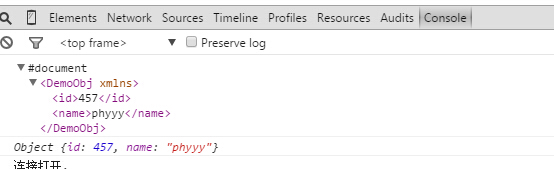

## 3.1 REST
- REST:Representational State Transfer;
- REST是一种数据导向web service,相对于SOAP是一种操作操作和处理导向的web service;
- Spring为对REST的支持提供了@RestController;
 - 在没有**@RestController**可以通过**@Controller,@RequestBody**组合实现REST控制器;
 - 但是我们经常会使用**@ResponseBody**这样很麻烦,且易忘记;
 - 使用**@RestController**替代**@Controller**,我们就不用使用**@ResponseBody**;
- REST支持的http method(通过@RequestMapping的method属性控制)
  - POST:新增
  - GET:读取
  - PUT/PATCH:更新
  - DELETE:删除
- `produces`的内容是指定返回的媒体类型让浏览器识别
  - 如返回text/plain的话,浏览器上的js回掉拿到的是字符串,需要自己转换对象;
  - 如返回application/json的话,浏览器上的js拿到的就是js对象而不是字符串,就不需要进行转换;

- 本例演示向控制器提交json数据,返回结果分别为json和xml格式;

## 3.2 示例

### 3.2.1 @RestController源码

从@RestController看出,@RestController是一个元注解,组合了@Controller,@ResponseBody,相当于同时使用了@Controller
@ResponseBody

```
@Target(ElementType.TYPE)
@Retention(RetentionPolicy.RUNTIME)
@Documented
@Controller
@ResponseBody
public @interface RestController {

	/**
	 * The value may indicate a suggestion for a logical component name,
	 * to be turned into a Spring bean in case of an autodetected component.
	 * @return the suggested component name, if any
	 * @since 4.0.1
	 */
	String value() default "";

}
```

### 3.2.2 代码

- 添加jackson依赖

jackson-dataformat-xml依赖`jackson-bind`,这样我们能同时返回xml和json

```
<dependency>
    <groupId>com.fasterxml.jackson.dataformat</groupId>
    <artifactId>jackson-dataformat-xml</artifactId>
    <version>2.5.3</version>
</dependency>
```
 若只需返回json数据(大多数项目都是这样),将上面依赖更换为
```
 <dependency>
    <groupId>com.fasterxml.jackson.core</groupId>
    <artifactId>jackson-databind</artifactId>
    <version>2.5.3</version>
</dependency>
```

- 传值对象

```
package com.wisely.web;

public class DemoObj {
	private Long id;
	private String name;
    //此处一定要有空构造,不然会有400 bad request,主要是jackson将json参数转换为对象需要
	public DemoObj() {
		super();
	}
	public DemoObj(Long id, String name) {
		super();
		this.id = id;
		this.name = name;
	}
	public Long getId() {
		return id;
	}
	public void setId(Long id) {
		this.id = id;
	}
	public String getName() {
		return name;
	}
	public void setName(String name) {
		this.name = name;
	}


}
```

- 控制器

```
package com.wisely.web;

import org.springframework.web.bind.annotation.RequestBody;
import org.springframework.web.bind.annotation.RequestMapping;
import org.springframework.web.bind.annotation.RestController;

@RestController
@RequestMapping("/api")
public class RESTController {
	@RequestMapping(value = "/getjson",produces={"application/json;charset=UTF-8"})
	public DemoObj getjson(@RequestBody DemoObj obj){
		return new DemoObj(obj.getId()+1, obj.getName()+"yy");
	}
	@RequestMapping(value = "/getxml",produces={"application/xml;charset=UTF-8"})
	public DemoObj getxml(@RequestBody DemoObj obj){
		return new DemoObj(obj.getId()+1, obj.getName()+"yy");
	}

}

```

- 页面代码

```
<script type="text/javascript" src="<c:url value="/js/jquery.js" />"></script>
<script type="text/javascript">
var json = {"id":456,"name":"phy"};

$.ajax({
	  url: "api/getjson",
	  data: JSON.stringify(json),
	  type:"POST",
	  contentType:"application/json",
	  success: function(data){
		  console.log(data);
	  }
	});
$.ajax({
	  url: "api/getxml",
	  data: JSON.stringify(json),
	  type:"POST",
	  contentType:"application/json",
	  success: function(data){
		  console.log(data);
	  }
	});
</script>
```

- 结果

