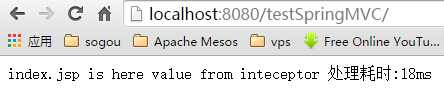

## 3.1 拦截器
- 拦截器实现了对每一个请求处理之前和之后进行相关的处理,类似于Servlet的filter;
- 可以实现**HandlerInterceptor**接口或者继承**HandlerInterceptorAdapter**类;
- 继承**HandlerInterceptorAdapter**类,因为使用接口要实现接口的所有方法;

## 3.2 示例

- 新建拦截器

```
package com.wisely.interceptors;

import javax.servlet.http.HttpServletRequest;
import javax.servlet.http.HttpServletResponse;

import org.springframework.stereotype.Service;
import org.springframework.web.servlet.ModelAndView;
import org.springframework.web.servlet.handler.HandlerInterceptorAdapter;
@Service
public class DemoInteceptor extends HandlerInterceptorAdapter {
	@Override
	public boolean preHandle(HttpServletRequest request,
			HttpServletResponse response, Object handler) throws Exception {
		System.out.println("request开始前");
		long startTime = System.currentTimeMillis();
		request.setAttribute("startTime", startTime);
		return true;
	}

	@Override
	public void postHandle(HttpServletRequest request,
			HttpServletResponse response, Object handler,
			ModelAndView modelAndView) throws Exception {
		System.out.println("request结束后");
		long startTime = (Long) request.getAttribute("startTime");
		request.removeAttribute("startTime");
		long endTime = System.currentTimeMillis();
		modelAndView.addObject("handlingTime", endTime - startTime);
	}
}

```

- 修改配置,注册拦截器

```
package com.wisely;

import org.springframework.beans.factory.annotation.Autowired;
import org.springframework.context.annotation.Bean;
import org.springframework.context.annotation.ComponentScan;
import org.springframework.context.annotation.Configuration;
import org.springframework.web.servlet.config.annotation.EnableWebMvc;
import org.springframework.web.servlet.config.annotation.InterceptorRegistry;
import org.springframework.web.servlet.config.annotation.WebMvcConfigurerAdapter;
import org.springframework.web.servlet.view.JstlView;
import org.springframework.web.servlet.view.UrlBasedViewResolver;

import com.wisely.interceptors.DemoInteceptor;

@Configuration
@ComponentScan("com.wisely")
@EnableWebMvc
public class DemoMVCConfig extends WebMvcConfigurerAdapter {

	@Autowired
	private DemoInteceptor demoInteceptor;

	@Bean
	public UrlBasedViewResolver viewResolver(){
		UrlBasedViewResolver resolver = new UrlBasedViewResolver();
        resolver.setPrefix("/WEB-INF/views/");
        resolver.setSuffix(".jsp");
        resolver.setViewClass(JstlView.class);
        return resolver;
	}

	@Override
	public void addInterceptors(InterceptorRegistry registry) {
	registry.addInterceptor(demoInteceptor);
	}

}

```

- 在index.jsp添加代码接受拦截器里放置的handlingTime

```
<%@ page language="java" contentType="text/html; charset=UTF-8"
    pageEncoding="UTF-8"%>
<!DOCTYPE html PUBLIC "-//W3C//DTD HTML 4.01 Transitional//EN" "http://www.w3.org/TR/html4/loose.dtd">
<html>
<head>
<meta http-equiv="Content-Type" content="text/html; charset=UTF-8">
<title>Insert title here</title>
</head>
<body>
index.jsp  is here

value from inteceptor 处理耗时:${handlingTime}ms

</body>
</html>
```
输出结果

