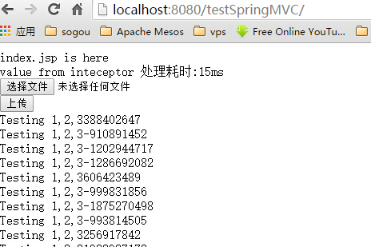

## 5.1 服务器端推送
- SSE(server send event)是一种服务器端向浏览器推送消息的技术,而不是我们常规的浏览器像server请求然后响应;
- 当我们需要使用server向浏览器主动推送数据的时候,请考虑使用该项技术,而不是考虑具有双向通讯功能的websocket;
- 以前我们用ajax轮询server也能实现,服务器负担大;
- 所有主流浏览器均支持服务器发送事件，除了 Internet Explorer(6,7,8,9);

## 5.2 示例

- 服务器推送控制器

```
package com.wisely.web;

import java.util.Random;

import org.springframework.stereotype.Controller;
import org.springframework.web.bind.annotation.RequestMapping;
import org.springframework.web.bind.annotation.ResponseBody;

@Controller
public class SSEController {
    //注意produces="text/event-stream"
	@RequestMapping(value="/push",produces="text/event-stream")
	public @ResponseBody String push(){
		 Random r = new Random();
         try {
                 Thread.sleep(5000);
         } catch (InterruptedException e) {
                 e.printStackTrace();
         }
         return "data:Testing 1,2,3" + r.nextInt() +"\n\n";
	}
}

```

- 页面代码

```
<div id="msg_from_server"></div>
<script type="text/javascript" src="<c:url value="/js/jquery.js" />"></script>
<script type="text/javascript">
if (!!window.EventSource) {
	   var source = new EventSource('push'); //为http://localhost:8080/testSpringMVC/push
	   s='';
	   source.addEventListener('message', function(e) {

		   s+=e.data+"<br/>"
		   $("#msg_from_server").html(s);

	   });

	   source.addEventListener('open', function(e) {
	        console.log("连接打开.");
	   }, false);

	   source.addEventListener('error', function(e) {
	        if (e.readyState == EventSource.CLOSED) {
	           console.log("连接关闭");
	        } else {
	            console.log(e.readyState);    
	        }
	   }, false);
	} else {
	        console.log("没有sse");
	}
</script>
```

- 效果

