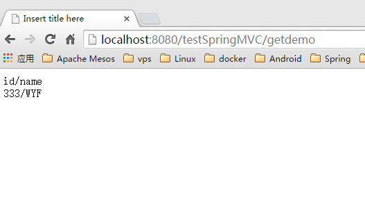
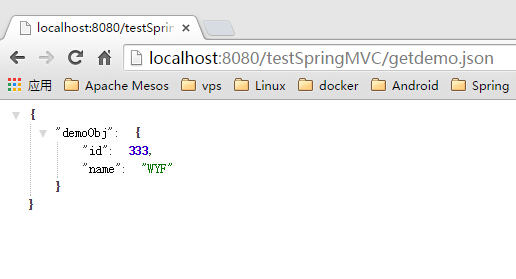
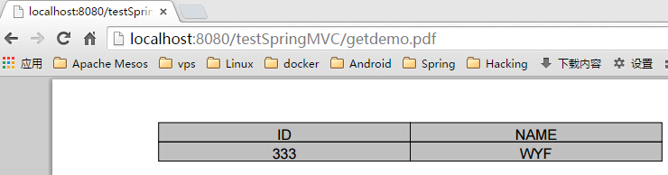
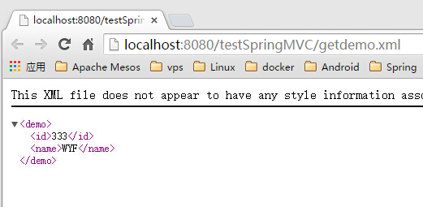
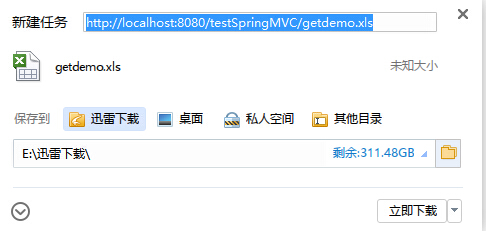
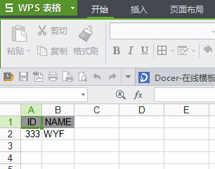

## 7.1 ContentNegotiatingViewResolver
- ContentNegotiatingViewResolver支持在Spring MVC下输出不同的格式;
- ContentNegotiatingViewResolver是ViewResolver的一个实现;
- ContentNegotiatingViewResolver使用request的媒体类型,根据扩展名选择不同的view输出不同的格式;
- ContentNegotiatingViewResolver不是自己处理view,而是代理给不同的ViewResolver来处理不同的view;
- 本例演示根据扩展名获得不同的页面;
- jsp
  - view:`WEB-INF/views/demoObj.jsp`
  - viewResolver:`UrlBasedViewResolver`或`InternalResourceViewResolver`
- pdf
  - view:`PdfView`
  - viewResolver:`PdfViewResolver`
- json
  - view:`MappingJackson2JsonView`
  - viewResolver:`JsonViewResolver`
- xml
  - view:`MarshallingView`
  - viewResolver:`XmlViewResolver`
- xls
  - view:`XlsView`
  - viewResolver:`XlsViewResolver`

## 7.2 示例
### 7.2.1 添加依赖

- 依赖
 - json依赖`03点睛Spring MVC 4.1-REST`已添加
 - xml

 ```
 <dependency>
    <groupId>org.springframework</groupId>
    <artifactId>spring-oxm</artifactId>
    <version>${spring-framework.version}</version>
</dependency>
 ```

 - pdf

 ```
 <dependency>
	<groupId>com.lowagie</groupId>
	<artifactId>itext</artifactId>
	<version>4.2.1</version>
</dependency>

 ```
 - xls

 ```
 <dependency>
    <groupId>org.apache.poi</groupId>
    <artifactId>poi</artifactId>
    <version>3.10-beta2</version>
</dependency>
 ```

### 7.2.2 定制view和viewResolve
#### 7.2.2.1 pdf

##### 7.2.2.1.1 view

 ```
 package com.wisely.view;

import java.awt.Color;
import java.util.Map;

import javax.servlet.http.HttpServletRequest;
import javax.servlet.http.HttpServletResponse;

import org.springframework.web.servlet.view.document.AbstractPdfView;

import com.lowagie.text.Document;
import com.lowagie.text.Element;
import com.lowagie.text.pdf.PdfPTable;
import com.lowagie.text.pdf.PdfWriter;
import com.wisely.domain.DemoObj;

public class PdfView extends AbstractPdfView {

	@Override
	protected void buildPdfDocument(Map<String, Object> model,
			Document document, PdfWriter writer, HttpServletRequest request,
			HttpServletResponse response) throws Exception {
		DemoObj demoObj = (DemoObj) model.get("demoObj");

        PdfPTable table = new PdfPTable(2);
        table.getDefaultCell().setHorizontalAlignment(Element.ALIGN_CENTER);
        table.getDefaultCell().setVerticalAlignment(Element.ALIGN_MIDDLE);
        table.getDefaultCell().setBackgroundColor(Color.lightGray);

        table.addCell("ID");
        table.addCell("NAME");

        table.addCell(demoObj.getId().toString());
        table.addCell(demoObj.getName());

        document.add(table);
	}

}

 ```

##### 7.2.2.1.2 viewResolver
```
package com.wisely.viewresolver;

import java.util.Locale;

import org.springframework.web.servlet.View;
import org.springframework.web.servlet.ViewResolver;

import com.wisely.view.PdfView;

public class PdfViewResolver implements ViewResolver{

	@Override
	public View resolveViewName(String viewName, Locale locale)
			throws Exception {
		return new PdfView();
	}


}

```

#### 7.2.2.2 xls
##### 7.2.2.2.1 view
```
package com.wisely.view;

import java.util.Map;

import javax.servlet.http.HttpServletRequest;
import javax.servlet.http.HttpServletResponse;

import org.apache.poi.hssf.usermodel.HSSFWorkbook;
import org.apache.poi.ss.usermodel.Cell;
import org.apache.poi.ss.usermodel.CellStyle;
import org.apache.poi.ss.usermodel.IndexedColors;
import org.apache.poi.ss.usermodel.Row;
import org.apache.poi.ss.usermodel.Sheet;
import org.springframework.web.servlet.view.document.AbstractExcelView;

import com.wisely.domain.DemoObj;

public class XlsView extends AbstractExcelView{

	@Override
	protected void buildExcelDocument(Map<String, Object> model,
			HSSFWorkbook workbook, HttpServletRequest request,
			HttpServletResponse response) throws Exception {
		 DemoObj demoObj = (DemoObj) model.get("demoObj");

	        Sheet sheet = workbook.createSheet("sheet1");
	        CellStyle style = workbook.createCellStyle();
	        style.setFillForegroundColor(IndexedColors.GREY_40_PERCENT.index);
	        style.setFillPattern(CellStyle.SOLID_FOREGROUND);
	        style.setAlignment(CellStyle.ALIGN_CENTER);
	        Row row = null;
	        Cell cell = null;
	        int rowCount = 0;
	        int colCount = 0;

	        // 创建头部
	        row = sheet.createRow(rowCount++);

	        cell = row.createCell(colCount++);
	        cell.setCellStyle(style);
	        cell.setCellValue("ID");

	        cell = row.createCell(colCount++);
	        cell.setCellStyle(style);
	        cell.setCellValue("NAME");


	        // 创建数据
	        row = sheet.createRow(rowCount++);
	        colCount = 0;
	        row.createCell(colCount++).setCellValue(demoObj.getId());
	        row.createCell(colCount++).setCellValue(demoObj.getName());
	        for (int i = 0; i < 3; i++)
	            sheet.autoSizeColumn(i, true);

	}

}

```
##### 7.2.2.2.2 viewResolver
```
package com.wisely.viewresolver;

import java.util.Locale;

import org.springframework.web.servlet.View;
import org.springframework.web.servlet.ViewResolver;

import com.wisely.view.XlsView;

public class XlsViewResolver implements ViewResolver{

	@Override
	public View resolveViewName(String viewName, Locale locale)
			throws Exception {
		return new XlsView();
	}

}

```
#### 7.2.2.3 json

##### 7.2.2.3.1 view
使用的是`MappingJackson2JsonView`
##### 7.2.2.3.2 viewResolver
```
package com.wisely.viewresolver;

import java.util.Locale;

import org.springframework.web.servlet.View;
import org.springframework.web.servlet.ViewResolver;
import org.springframework.web.servlet.view.json.MappingJackson2JsonView;

public class JsonViewResolver implements ViewResolver{

	@Override
	public View resolveViewName(String viewName, Locale locale)
			throws Exception {
		MappingJackson2JsonView view = new MappingJackson2JsonView();
        view.setPrettyPrint(true);
        return view;
	}

}

```
#### 7.2.2.4 xml

##### 7.2.2.4.1 DemoBean的额外配置
```
package com.wisely.domain;

import javax.xml.bind.annotation.XmlElement;
import javax.xml.bind.annotation.XmlRootElement;

@XmlRootElement(name = "demo")
public class DemoObj {
	private Long id;
	private String name;

	public DemoObj() {
		super();
	}

	public DemoObj(Long id, String name) {
		super();
		this.id = id;
		this.name = name;
	}

	public Long getId() {
		return id;
	}

	@XmlElement
	public void setId(Long id) {
		this.id = id;
	}

	public String getName() {
		return name;
	}

	@XmlElement
	public void setName(String name) {
		this.name = name;
	}

}

```

##### 7.2.2.4.2 view
使用的是`MarshallingView`
##### 7.2.2.4.3 viewResolver
```
package com.wisely.viewresolver;

import java.util.Locale;

import org.springframework.oxm.jaxb.Jaxb2Marshaller;
import org.springframework.web.servlet.View;
import org.springframework.web.servlet.ViewResolver;
import org.springframework.web.servlet.view.xml.MarshallingView;

import com.wisely.domain.DemoObj;

public class XmlViewResolver implements ViewResolver {

	@Override
	public View resolveViewName(String viewName, Locale locale)
			throws Exception {
		MarshallingView view = new MarshallingView();
		Jaxb2Marshaller marshaller = new Jaxb2Marshaller();
		marshaller.setClassesToBeBound(DemoObj.class);
		marshaller.setPackagesToScan("com.wisely.domain");
		view.setMarshaller(marshaller);
		return view;
	}

}

```
#### 7.2.2.5 jsp
##### 7.2.2.5.1 view
`WEB-INF/views/demoObj.jsp`

```
<%@ taglib uri="http://java.sun.com/jsp/jstl/core" prefix="c" %>
<%@ page language="java" contentType="text/html; charset=UTF-8"
    pageEncoding="UTF-8"%>
<!DOCTYPE html PUBLIC "-//W3C//DTD HTML 4.01 Transitional//EN" "http://www.w3.org/TR/html4/loose.dtd">
<html>
<head>
<meta http-equiv="Content-Type" content="text/html; charset=UTF-8">
<title>Insert title here</title>

</head>
<body>
		id/name <br/>
		${demoObj.id}/${demoObj.name}
</body>
</html>
```
##### 7.2.2.5.2 viewResolver
`UrlBasedViewResolver`或`InternalResourceViewResolver`

### 7.2.3 配置resolver
```
package com.wisely;

import java.util.ArrayList;
import java.util.List;

import org.springframework.context.annotation.Bean;
import org.springframework.context.annotation.ComponentScan;
import org.springframework.context.annotation.Configuration;
import org.springframework.http.MediaType;
import org.springframework.web.accept.ContentNegotiationManager;
import org.springframework.web.multipart.MultipartResolver;
import org.springframework.web.multipart.commons.CommonsMultipartResolver;
import org.springframework.web.servlet.ViewResolver;
import org.springframework.web.servlet.config.annotation.ContentNegotiationConfigurer;
import org.springframework.web.servlet.config.annotation.EnableWebMvc;
import org.springframework.web.servlet.config.annotation.InterceptorRegistry;
import org.springframework.web.servlet.config.annotation.ResourceHandlerRegistry;
import org.springframework.web.servlet.config.annotation.WebMvcConfigurerAdapter;
import org.springframework.web.servlet.view.ContentNegotiatingViewResolver;
import org.springframework.web.servlet.view.JstlView;
import org.springframework.web.servlet.view.UrlBasedViewResolver;

import com.wisely.interceptors.DemoInteceptor;
import com.wisely.viewresolver.JsonViewResolver;
import com.wisely.viewresolver.PdfViewResolver;
import com.wisely.viewresolver.XlsViewResolver;
import com.wisely.viewresolver.XmlViewResolver;

@Configuration
@ComponentScan("com.wisely")
@EnableWebMvc
public class DemoMVCConfig extends WebMvcConfigurerAdapter {

	//在此---jsp viewResolver
	@Bean
	public UrlBasedViewResolver viewResolver() {
		UrlBasedViewResolver resolver = new UrlBasedViewResolver();
		resolver.setPrefix("/WEB-INF/views/");
		resolver.setSuffix(".jsp");
		resolver.setViewClass(JstlView.class);
		return resolver;
	}

	// 注册自定义拦截器
	@Override
	public void addInterceptors(InterceptorRegistry registry) {
		registry.addInterceptor(demoInteceptor());
	}

	// 自定义拦截器
	@Bean
	public DemoInteceptor demoInteceptor() {
		return new DemoInteceptor();
	}

	// 静态资源映射
	@Override
	public void addResourceHandlers(ResourceHandlerRegistry registry) {
		registry.addResourceHandler("/js/**").addResourceLocations("/js/");
	}

	// 文件上传设置
	@Bean
	public MultipartResolver multipartResolver() {
		CommonsMultipartResolver multipartResolver = new CommonsMultipartResolver();
		multipartResolver.setMaxUploadSize(1000000);
		return multipartResolver;
	}

	// 在此---配置ContentNegotiationManager,在无后缀名情况下默认为jsp view resolver
	@Override
	public void configureContentNegotiation(
			ContentNegotiationConfigurer configurer) {
		configurer.ignoreAcceptHeader(true).defaultContentType(
				MediaType.TEXT_HTML);
	}

	// 在此---配置ContentNegotiatingViewResolver,通过此代理到不同的viewResolover
	@Bean
	public ViewResolver contentNegotiatingViewResolver(
			ContentNegotiationManager manager) {

		ContentNegotiatingViewResolver resolver = new ContentNegotiatingViewResolver();
		resolver.setContentNegotiationManager(manager);
		List<ViewResolver> resolvers = new ArrayList<ViewResolver>();

		resolvers.add(xmlViewResolver());
		resolvers.add(jsonViewResolver());
		resolvers.add(viewResolver());// jsp view resolver
		resolvers.add(pdfViewResolver());
		resolvers.add(xlsViewResolver());

		resolver.setViewResolvers(resolvers);
		return resolver;
	}

	//在此---xml viewResolver
	@Bean
	public ViewResolver xmlViewResolver() {
		return new XmlViewResolver();
	}

	//在此---json viewResolver
	@Bean
	public ViewResolver jsonViewResolver() {
		return new JsonViewResolver();
	}
	//在此---pdf viewResolver
	@Bean
	public ViewResolver pdfViewResolver() {
		return new PdfViewResolver();
	}
	//在此---excel viewResolver
	@Bean
	ViewResolver xlsViewResolver() {
		return new XlsViewResolver();
	}

}

```
### 7.2.4 演示控制器
```
package com.wisely.web;

import org.springframework.stereotype.Controller;
import org.springframework.ui.Model;
import org.springframework.web.bind.annotation.RequestMapping;
import org.springframework.web.bind.annotation.RequestMethod;

import com.wisely.domain.DemoObj;

@Controller
public class ContentController {
	@RequestMapping(value = "/getdemo",method = RequestMethod.GET)
	public String getDemo(Model model){
		DemoObj demoObj = new DemoObj(333l, "WYF");
		model.addAttribute("demoObj",demoObj);
		return "demoObj";

	}

}

```
### 7.2.5 结果
#### 7.2.5.1 jsp

#### 7.2.5.2 json

#### 7.2.5.3 pdf

#### 7.2.5.4 xml

#### 7.2.5.5 xls

