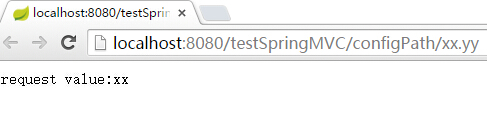
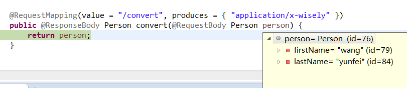

## 8.1 配置

- Spring MVC的配置是通过继承`WebMvcConfigurerAdapter`类并重载其方法实现的;
- 前几个教程已做了得配置包括
  - **01点睛Spring MVC 4.1-搭建环境** 配置viewResolver
  - **03点睛Spring MVC 4.1-REST** 静态资源映射
  - **04点睛Spring MVC 4.1-拦截器** 配置拦截器
  - **06点睛Spring MVC 4.1-文件上传** 配置multipartResolver
  - **07点睛Spring MVC4.1-ContentNegotiatingViewResolver** 配置ContentNegotiatingViewResolver

- 本节将演示如下配置
 - 默认

## 8.2 演示
### 8.2.1 配置路径匹配参数
- 在Spring MVC中路径参数如果带`.`的话,`.`后面的值将被忽略,本例演示配置`configurePathMatch`不忽略点后面的参数;

- `演示控制器`

```java
@RequestMapping("/configPath/{test}")
	public @ResponseBody String configPath(@PathVariable String test){
		return "request value:"+test;
	}

```
- 运行:访问http://localhost:8080/testSpringMVC/configPath/xx.yy



- 在继承`WebMvcConfigurerAdapter`的`DemoMVCConfig`类中重载`configurePathMatch`

```java
    @Override
    public void configurePathMatch(PathMatchConfigurer configurer) {
    	 configurer.setUseSuffixPatternMatch(false);
    }
```

- 再次运行:访问访问http://localhost:8080/testSpringMVC/configPath/xx.yy


### 8.2.2 快捷定义ViewController

- 我们经常涉及到页面转向,但没任何处理业务的时候,快捷的页面转向定义会节省好多代码;
- 在views目录下建一个任意的`test.jsp`
- 常规的方案是这样写的
```java
@RequestMapping("/mytest")
	public String test(){
		return "test";
	}
```
- 在继承`WebMvcConfigurerAdapter`的`DemoMVCConfig`类中重载`addViewControllers`
```java
  @Override
    public void addViewControllers(ViewControllerRegistry registry) {
    	registry.addViewController("/mytest").setViewName("/test");
    	//添加更多
    }
```

- 以上效果等同,均会指向views下的test.jsp

### 8.2.3 配置`HttpMessageConverter`
- `HttpMessageConverter`是对http的request和response进行自动转换
- 配置`HttpMessageConverter`可重载下面两个方法任意一个
 - `configureMessageConverters`:重载会覆盖掉spring mvc默认注册的多个`HttpMessageConverter`
 - `extendMessageConverters`:仅添加一个自定义的`HttpMessageConverter`,不覆盖默认注册的`HttpMessageConverter`

- 通过对上面的讲述,我们一般是重载`extendMessageConverters`方法;
- 下面我们演示使用js向spring mvc发送自定义格式的字符串(属性用-隔开),通过自定义的`HttpMessageConverter`自动转换成对象,然后通过`HttpMessageConverter`输出指定格式到浏览器

- 测试javabean
 - Person

```java
package com.wisely.domain;

public class Person {

	private String firstName;
	private String lastName;
    	public Person(String firstName, String lastName) {
		super();
		this.firstName = firstName;
		this.lastName = lastName;
	}
	public String getFirstName() {
		return firstName;
	}
	public void setFirstName(String firstName) {
		this.firstName = firstName;
	}
	public String getLastName() {
		return lastName;
	}
	public void setLastName(String lastName) {
		this.lastName = lastName;
	}

}
```
- 自定义`HttpMessageConverter`：`WiselyMessageConverter`

```java
package com.wisely.converters;

import java.io.IOException;
import java.nio.charset.Charset;

import org.springframework.http.HttpInputMessage;
import org.springframework.http.HttpOutputMessage;
import org.springframework.http.MediaType;
import org.springframework.http.converter.AbstractHttpMessageConverter;
import org.springframework.http.converter.HttpMessageNotReadableException;
import org.springframework.http.converter.HttpMessageNotWritableException;
import org.springframework.util.StreamUtils;

import com.wisely.domain.Person;

public class WiselyMessageConverter extends AbstractHttpMessageConverter<Person> {

	 //自定义媒体类型
    public WiselyMessageConverter(){
        super(new MediaType("application", "x-wisely", Charset.forName("UTF-8")));
    }
    //从request里获得构造Person实例的数据
    @Override
    protected Person readInternal(Class<? extends Person> clazz,
     HttpInputMessage inputMessage) throws IOException, HttpMessageNotReadableException {
        String temp = StreamUtils.copyToString(inputMessage.getBody(), Charset.forName("UTF-8"));
        String[] tempArr = temp.split("-");
        return new Person(tempArr[0],tempArr[1]);
    }

    //只支持Person类
    @Override
    protected boolean supports(Class<?> clazz) {
        return Person.class.isAssignableFrom(clazz);
    }

    //将person实例转换成你想要的字符串格式
    @Override
    protected void writeInternal(Person person, HttpOutputMessage outputMessage) 
                                 throws IOException, HttpMessageNotWritableException {
        String out = "hello:" +person.getFirstName() + "-" + person.getLastName();
        outputMessage.getBody().write(out.getBytes());
    }

}


```

- 配置`WiselyMessageConverter`

```java
  @Override
    public void extendMessageConverters(List<HttpMessageConverter<?>> converters) {
        WiselyMessageConverter converter = new WiselyMessageConverter();
        converters.add(converter);
    }

```

注释掉上例的`configureContentNegotiation`,这里会自动将媒体类型变为text/html

```java
// 配置ContentNegotiationManager,在无后缀名情况下默认为jsp view resolver
//	@Override
//	public void configureContentNegotiation(
//			ContentNegotiationConfigurer configurer) {
//		//忽略请求的header信息,并将contentType置为text/html
//		configurer.ignoreAcceptHeader(true).defaultContentType(
//				MediaType.TEXT_HTML);
//	}
```

- 测试控制器

```java
@RequestMapping(value = "/convert", produces = { "application/x-wisely" })
	public @ResponseBody Person convert(@RequestBody Person person) {
		return person;
	}

```


- 测试页面：test.jsp

```javascript
<%@ page language="java" contentType="text/html; charset=UTF-8"
    pageEncoding="UTF-8"%>
<!DOCTYPE html PUBLIC "-//W3C//DTD HTML 4.01 Transitional//EN" "http://www.w3.org/TR/html4/loose.dtd">
<html>
<head>
<meta http-equiv="Content-Type" content="text/html; charset=UTF-8">
<title>Insert title here</title>
</head>
<body>
	<div id="resp"></div><input type="button" onclick="req();" value="请求"/>
<script src="js/jquery.js" type="text/javascript"></script>
<script>
    function req(){
        $.ajax({
            url: "convert",
            data: "wang-yunfei",//注意此处的格式
            type:"POST",
            contentType:"application/x-wisely",
            success: function(data){
                $("#resp").html(data);
            }
        });
    }

</script>
</body>
</html>
```

- 运行效果




