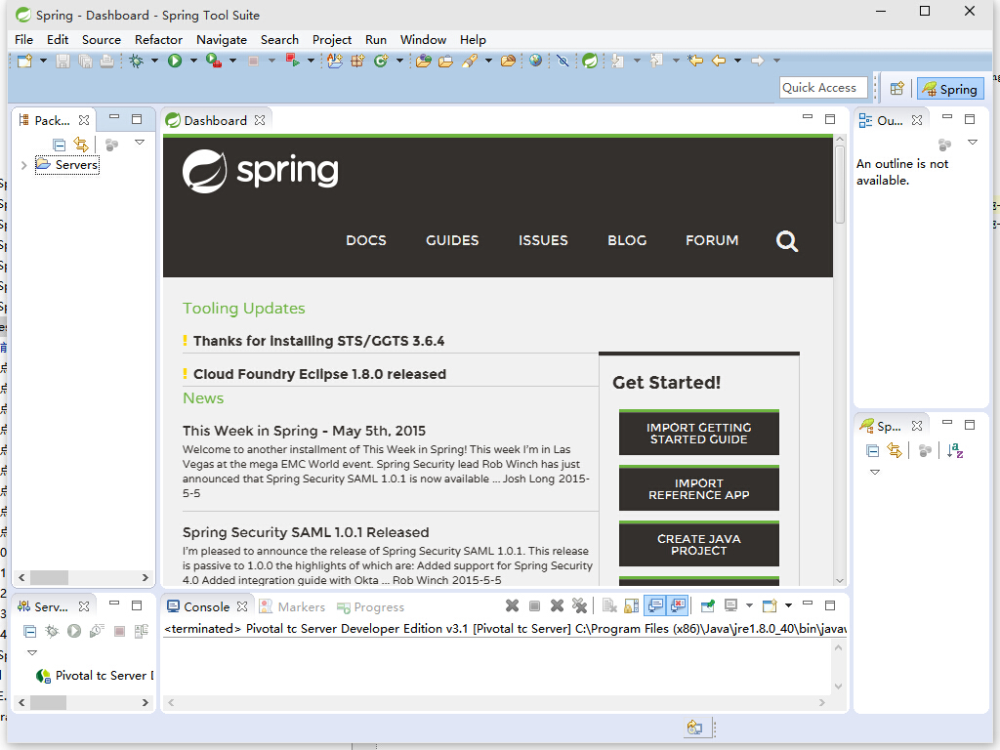
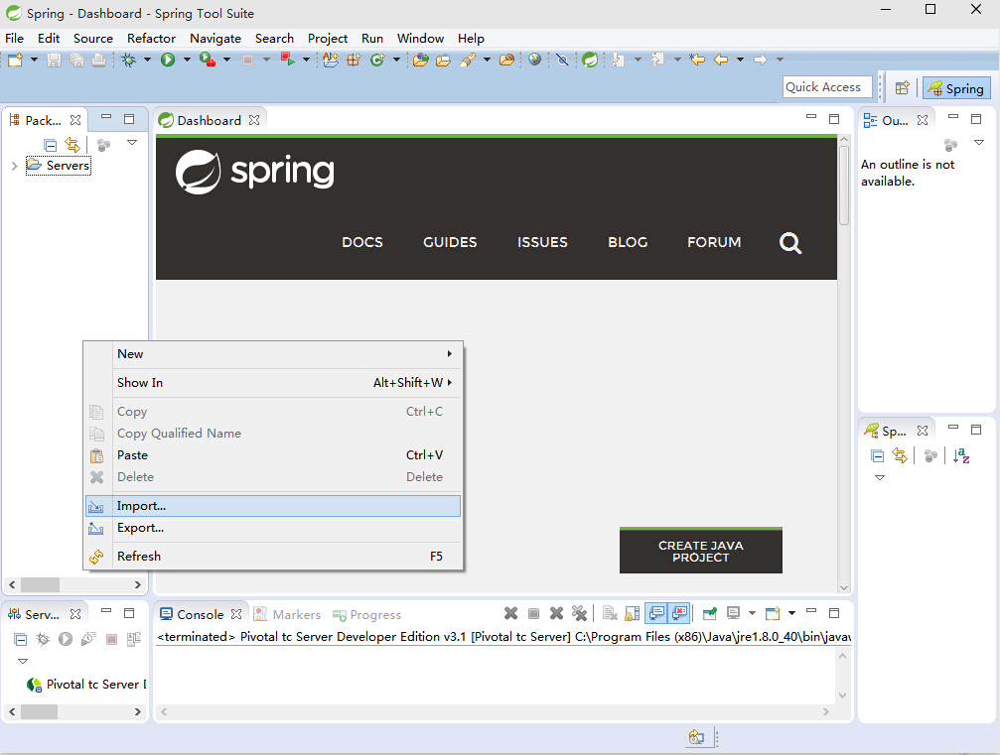
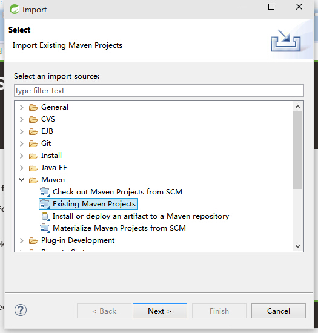
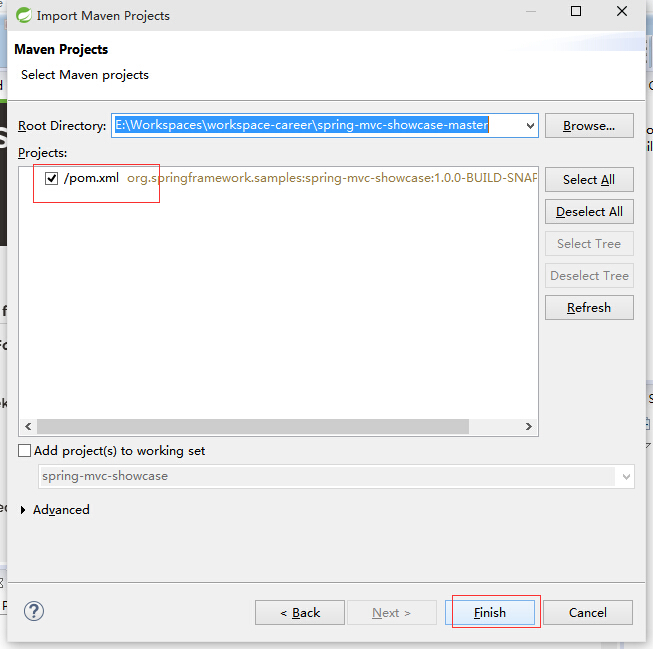
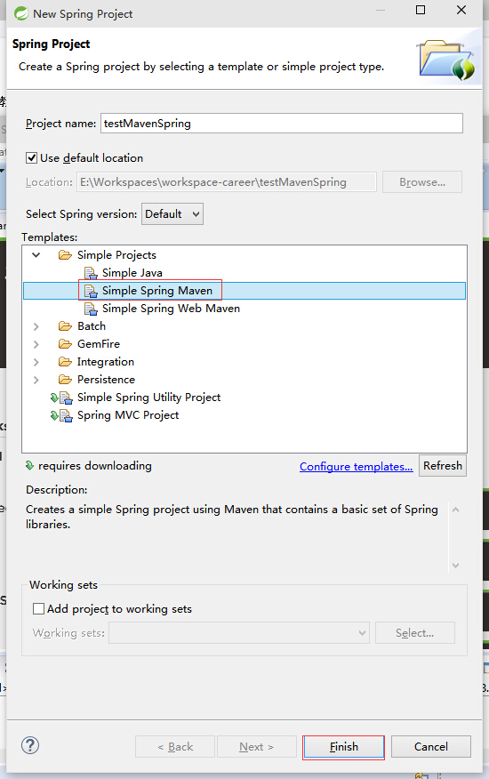
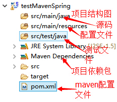
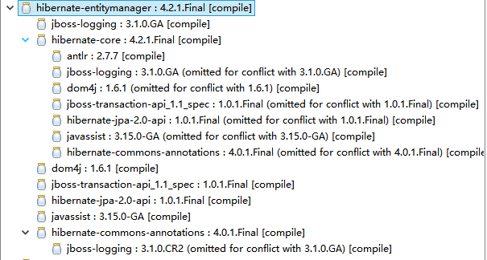
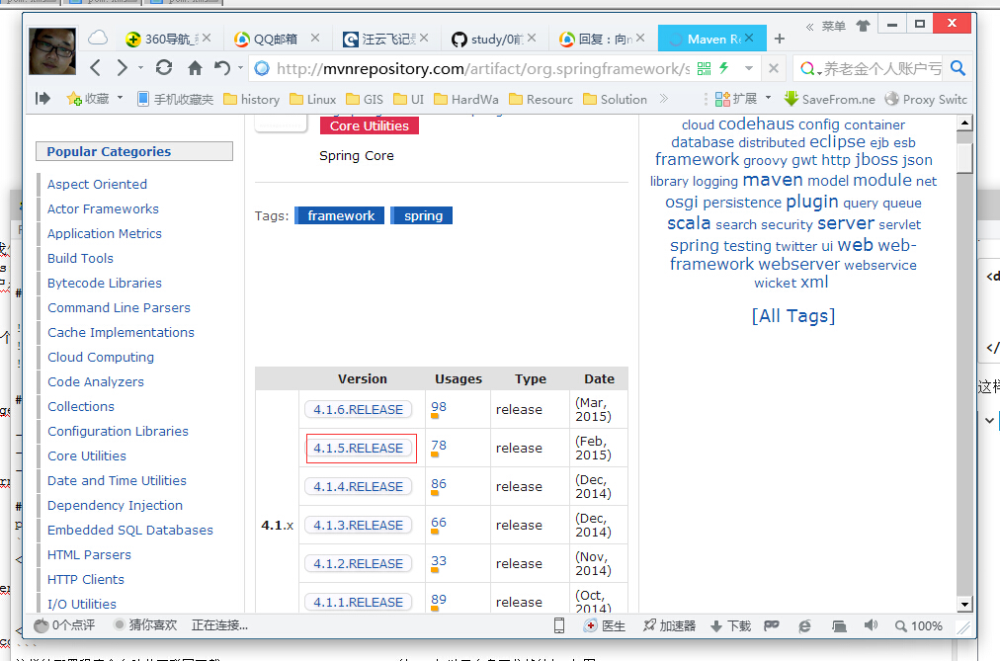
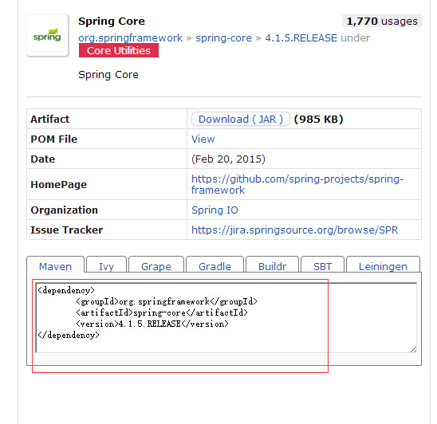

## 0.1 前置条件
- Spring 4.1提倡基于Java Config和注解的配置，所以本教程通篇不会采用任何和xml配置相关的内容;
- 本教程默认读者有一定的Java Web及Spring使用基础;
- 本教程采用点睛的形式展现Spring各个知识点，不会深入到各个知识点的方方面面，目的是为了初学者快速掌握Spring的各方面知识;
- Spring的官方开发的示例都使用maven和gradle作为构建工具,本教程采用maven作为构建工具;
- 使用Spring Tool Suite(STS基于eclipse,内置对spring及maven的支持)作为IDE(当然你可以使用原版eclipse并安装sts与maven插件);

## 0.2 开发环境搭建演示

### 0.2.1 STS下载地址,解压可用
  - 32位:http://dist.springsource.com/release/STS/3.6.4.RELEASE/dist/e4.4/spring-tool-suite-3.6.4.RELEASE-e4.4.2-win32.zip
  - 64位:http://dist.springsource.com/release/STS/3.6.4.RELEASE/dist/e4.4/spring-tool-suite-3.6.4.RELEASE-e4.4.2-win32-x86_64.zip

 

### 0.2.2导入已有的spring maven项目

 

 

 

### 0.2.3 新建基于spring的maven项目






### 0.2.4 关于maven

- maven是一个项目构建工具,利用maven我们不需要手工拷贝包到项目中,只需通过pom.xml文件里的包的描述自动从互联网下载相关依赖包;
- 若无互联网环境可搭建maven私服(nexus:http://www.sonatype.org/nexus/);
- 下载的jar包默认放置在`C:\Users\用户名\.m2`目录下;

### 0.2.5 关于maven的pom.xml
pom.xml中最关键的是`<dependency>`,一个依赖是由三部分组成groupId,artifactId,version组成,如:
```xml
<dependency>
    <groupId>org.hibernate</groupId>
    <artifactId>hibernate-entitymanager</artifactId>
    <version>4.2.1.Final</version>
</dependency>
```
这样的配置程序会自动从互联网下载hibernate-entitymanager的jar包以及自身要依赖的包,如图：



### 0.2.6 如何找到依赖包
虽然在maven中添加依赖是很简单的,但很多时候不知道依赖该怎么写,这个时候我们可以借助`http://mvnrepository.com`这个网站来检索.






### 0.2.7 构建特殊的maven依赖包

像oracle的jdbc驱动,互联网上的共有maven服务器上市不能下载的，如果我们要使用的oracle的驱动的话需要自己手动构建.
在cmd下输入下面一行代码:

```java
mvn install:install-file -DgroupId=com.oracle "-DartifactId=ojdbc14"
"-Dversion=10.2.0.2.0" "-Dpackaging=jar" "-Dfile=D:\ojdbc14.jar"
```

此时在pom.xml用如下引入:
```xml
<dependency>
    <groupId>com.oracle</groupId>
    <artifactId>ojdbc14</artifactId>
    <version>10.2.0.2.0</version>
</dependency>
```


