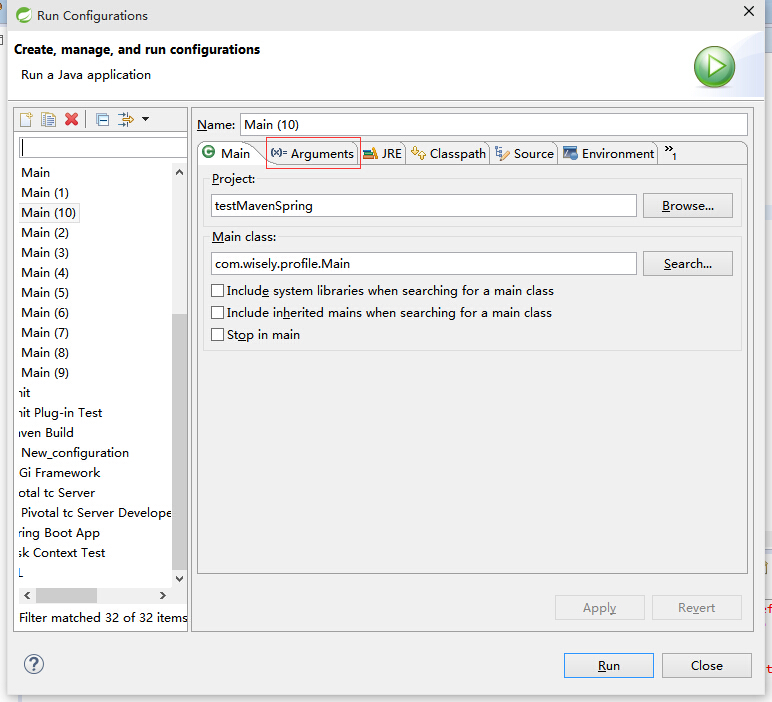
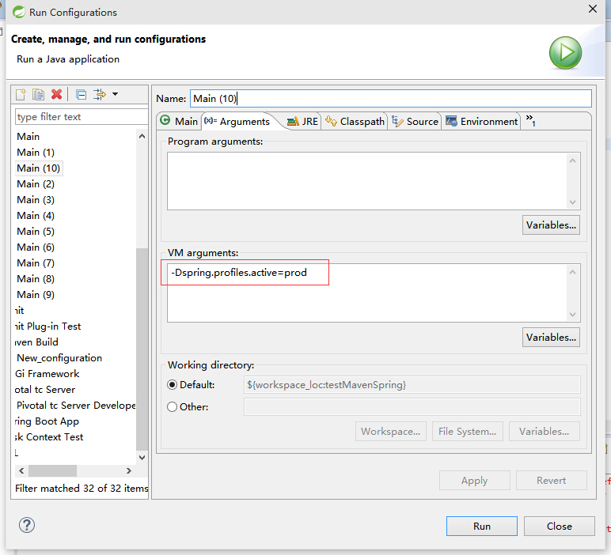

## 8.1 Profile
- Profile让在不同环境下使用不同的配置提供了支持(如开发环境下的配置和生产环境下的配置肯定是不同的,如：数据库的配置);
  - 通过设定**Environment**的**ActiveProfiles**来设定当前context需要使用的配置环境
  - 通过设定jvm的**spring.profiles.active**参数来设置配置环境(web项目中设置在servlet的context parameter中)

## 8.2 示例

### 8.2.1 新建测试bean
```java
package com.wisely.profile;


public class DemoBean {
	private String url;

	public DemoBean(String url) {
		super();
		this.url = url;
		System.out.println("地址为："+url);
	}

	public String getUrl() {
		return url;
	}

	public void setUrl(String url) {
		this.url = url;
	}


}

```
### 8.2.2 编写配置文件
```java
package com.wisely.profile;

import org.springframework.context.annotation.Bean;
import org.springframework.context.annotation.Configuration;
import org.springframework.context.annotation.Profile;

@Configuration
public class DemoConfig {

	@Bean
	@Profile("dev")
	public DemoBean devDemoBean(){
		return new DemoBean("http://www.baidu.com");
	}

	@Bean
	@Profile("prod")
	public DemoBean prodDemoBean(){
		return new DemoBean("http://www.qq.com");
	}

}

```
### 8.2.3 测试
#### 8.2.3.1 使用Environment选择配置
```java
package com.wisely.profile;

import org.springframework.context.annotation.AnnotationConfigApplicationContext;

public class Main {

	public static void main(String[] args) {
		AnnotationConfigApplicationContext context =
        		new AnnotationConfigApplicationContext();
		context.getEnvironment().setActiveProfiles("dev");
		context.scan("com.wisely.profile");
		context.refresh();
		context.close();

	}

}

```
输出结果
```
地址为：http://www.baidu.com
```
#### 8.2.3.2 使用JVM参数选择配置
```java
package com.wisely.profile;

import org.springframework.context.annotation.AnnotationConfigApplicationContext;

public class Main {

	public static void main(String[] args) {
		AnnotationConfigApplicationContext context =  new AnnotationConfigApplicationContext();
		context.scan("com.wisely.profile");
		context.refresh();
		context.close();

	}

}

```


输出结果:
```
地址为：http://www.qq.com
```
#### 8.2.3.2 在web项目中的配置
- web.xml(servlet 2.5及以下)

```xml
<servlet>
    <servlet-name>dispatcher</servlet-name>
    <servlet-class>org.springframework.web.servlet.DispatcherServlet</servlet-class>
    <init-param>
        <param-name>spring.profiles.active</param-name>
        <param-value>production</param-value>
    </init-param>
</servlet>
```
- java config(servlet 3.0及以上)

```java
public class WebInit implements WebApplicationInitializer {

    @Override
    public void onStartup(ServletContext container) throws ServletException {
        container.setInitParameter("spring.profiles.default", "dev");

    }

}
```


