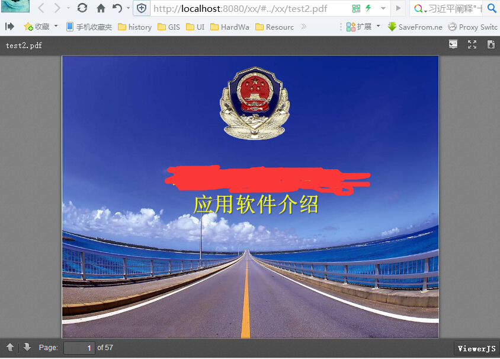

在线浏览ppt的思路是
- 先将ppt转为pdf
- 再用js调用pdf在线查看
- 主要借助的工具有**openoffice**,**jodconveter**,**viewerjs**

# 1 服务端

## 1.1 安装openoffice
- 下载[openoffice](http://iweb.dl.sourceforge.net/project/openofficeorg.mirror/localized/zh-CN/3.4.1/Apache_OpenOffice_incubating_3.4.1_Win_x86_install_zh-CN.exe
)

- 版本为3.4.1,高版本可能不支持
- 默认安装
- 启动openoffice服务

```shell
C:\Program Files (x86)\OpenOffice.org 3\program
soffice -headless -accept="socket,host=127.0.0.1,port=8100;urp;
```

## 1.2 编译jodconverter
- 下载[hyperic-sigar](http://colocrossing.dl.sourceforge.net/project/sigar/sigar/1.6/hyperic-sigar-1.6.4.zip
)

- 解压hyperic-sigar-1.6.4到任意E盘(随意)

- 下载[jodconverter](https://github.com/mirkonasato/jodconverter)

- 进入`jodconverter-core`目录

- 运行maven命令
```java
mvn -Djava.library.path=E:/hyperic-sigar-1.6.4/sigar-bin/lib -DskipTests install
```
- 这是target目录和.m2目录下便有了`jodconverter-core-3.0-SNAPSHOT.jar`,


## 1.3 转换代码

- 开发的项目加入jodconverter-core依赖,pom.xml
```xml
<dependency>
    <groupId>org.artofsolving.jodconverter</groupId>
    <artifactId>jodconverter-core</artifactId>
    <version>3.0-SNAPSHOT</version>
</dependency>
```

- 代码,默认在Spring的环境下

 - 转换服务
 
 ```java
 @Service
public class PptConverter {
    public void ppt2PDF(File inputFile, File outputFile) {

        // 如果目标路径不存在, 则新建该路径
        if (!outputFile.getParentFile().exists()) {
            outputFile.getParentFile().mkdirs();
        }

        // convert
        ExternalOfficeManagerConfiguration configuration = new ExternalOfficeManagerConfiguration();
        configuration.setConnectionProtocol(OfficeConnectionProtocol.SOCKET);
        configuration.setPortNumber(8100);
        OfficeManager officeManager= configuration.buildOfficeManager();
        OfficeDocumentConverter converter = new OfficeDocumentConverter(officeManager);
        converter.convert(inputFile, outputFile);

    }
}

 ```

 - 调用处

 ```java
  @Autowired
    PptConverter pptConverter;
    @RequestMapping("xx")
    public String convertAndView() throws Exception{
        File inputFile =  new File("输入路径---请自行修改");
        File outFile = new File("输出路径---请自行修改");
        pptConverter.ppt2PDF(inputFile,outFile);
        return "viewer";
    }
 ```


# 2 客户端

- 下载[viewerjs](http://viewerjs.org/releases/viewerjs-0.5.7.zip)
- 解压,将ViewerJS下的所有内容放置项目webapp下(可直接在项目路径后直接访问的路径都可以)
- 在同级目录下放置一个pdf(test2.pdf)
- 如项目名是`xx`
- 在线预览该pdf的路径为`http://localhost:8080/xx/#../xx/test2.pdf`
- 效果如下

- 在实际项目里可通过`iframe`嵌入这个地址到别的页面